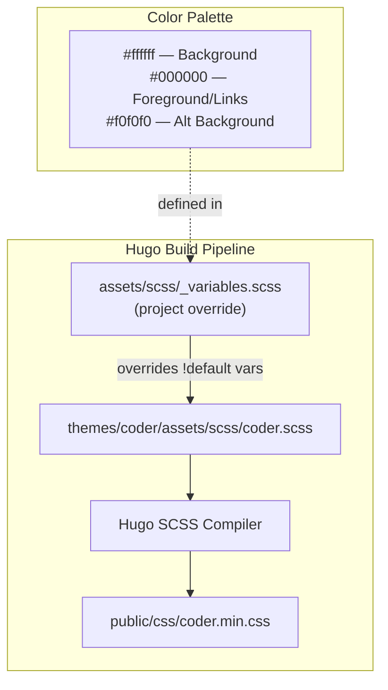

# ADR-0001: Blog Design — White/Black Academic Theme Following blog.martisak.se

**Date**: 2026-02-22
**Status**: Proposed
**Deciders**: Alex Djalali

## Context

The blog currently uses the Hugo Coder theme with default colors (`#fafafa` background, `#212121` foreground, `#1565c0` link color). The design needs to be updated to follow the visual style of [blog.martisak.se](https://blog.martisak.se/), which also uses the Hugo Coder theme but with a clean, academic aesthetic.

The specific requirements are:
- **Base color**: Pure white (`#ffffff`)
- **Secondary color**: Black (`#000000`)
- Maintain the same layout structure, typography, and navigational patterns as the reference site (centered single-column layout, circular avatar, system font stack, horizontal navigation, post listing with dates)

Both sites already share the Hugo Coder theme, so this decision is primarily about color palette customization and ensuring the layout matches the reference site's clean academic look.

## Decision

Override the Coder theme's SCSS variables using Hugo's asset pipeline (project-level `assets/scss/` takes precedence over `themes/coder/assets/scss/`). This avoids modifying the theme submodule directly, keeping upgrades clean.

### Color Changes

| Variable | Current Value | New Value |
|----------|--------------|-----------|
| `$bg-color` | `#fafafa` | `#ffffff` (pure white) |
| `$fg-color` | `#212121` | `#000000` (pure black) |
| `$alt-bg-color` | `#e0e0e0` | `#f0f0f0` (very light gray) |
| `$alt-fg-color` | `#000` | `#000000` (black — unchanged) |
| `$darker-alt-bg-color` | `#ccc` | `#e8e8e8` (light gray for code blocks) |
| `$link-color` | `#1565c0` | `#000000` (black links, matching reference) |

### Layout Alignment

The reference site uses:
- Centered single-column layout (max-width ~90rem) — already matches Coder defaults
- Circular avatar on homepage — already present
- Horizontal navigation with uppercase site title — already present
- Post listing with date + title in a row — already present
- System font stack — already matches

No layout template changes are required. The sites already share the same theme structure.

### Dark Mode

Keep dark mode support (`colorScheme = "auto"`) with the existing dark palette since the user's requirement specifies light mode colors only. Dark mode colors remain untouched.

## Alternatives Considered

| Alternative | Pros | Cons |
|-------------|------|------|
| **A: Override SCSS variables via project `assets/`** (chosen) | Clean separation from theme; survives theme updates; Hugo-native approach | Requires understanding of Hugo asset pipeline precedence |
| **B: Fork the Coder theme and edit directly** | Simple, direct edits in one place | Breaks future theme updates; maintains a fork; violates submodule pattern |
| **C: Use a custom CSS file loaded after theme CSS** | No SCSS knowledge needed; purely additive | Specificity wars; duplicated selectors; harder to maintain; overrides are fragile |
| **D: Switch to a different theme** | Could find a closer match out of the box | Migration effort; loss of existing configuration; reference site uses Coder anyway |

## Architecture Diagram

> The project-level `_variables.scss` sets SCSS variables with `!default`, which Hugo resolves before the theme's own `_variables.scss`. Since the theme also uses `!default`, project-level values take precedence.

## Consequences

### Positive
- Clean white/black aesthetic matching the reference academic blog
- No changes to the theme submodule — future `git submodule update` works cleanly
- Minimal change surface: a single SCSS variable override file
- Dark mode remains functional for users who prefer it

### Negative
- Pure black text on pure white may reduce readability for some users compared to the softer `#212121`/`#fafafa` defaults (higher contrast)
- Black links lose the visual distinction from body text — users may not immediately recognize clickable elements (mitigated by underline on hover, which Coder already provides)

### Risks
- Hugo SCSS pipeline behavior may differ across Hugo versions — override precedence should be tested after Hugo upgrades
- If the Coder theme removes `!default` flags from variables in a future update, the override mechanism would break

## Implementation Notes

- **Files to create**: `assets/scss/_variables.scss` (project-level override)
- **Files affected**: None modified — the override is purely additive
- **Migration**: No data migration; purely visual change
- **Dependencies**: Hugo's SCSS compiler (already configured)
- **Testing strategy**:
  - Run `hugo server` locally and visually compare against blog.martisak.se
  - Verify all pages: homepage, post listing, single post, categories, tags, about, CV, publications
  - Test dark mode toggle still works
  - Test responsive layout on mobile viewport
  - Verify code block styling and syntax highlighting contrast
- **Rollback plan**: Delete `assets/scss/_variables.scss` to revert to theme defaults

## Quality Checklist

### Architecture & Design

- [x] ADR addresses a real architectural concern (not a trivial implementation detail)
- [x] Alternatives section has at least 2 genuine options
- [x] Consequences section is honest about trade-offs
- [x] Implementation notes include a testing strategy
- [x] Architecture diagram accurately reflects the change

### Coding Patterns (consider which apply to the decision)

- [ ] **Fluent Interface** — N/A
- [ ] **Builder Pattern** — N/A
- [ ] **DRY** — N/A
- [ ] **Decorator Pattern** — N/A
- [ ] **Strategy Pattern** — N/A
- [ ] **Observer Pattern** — N/A
- [ ] **Singleton Pattern** — N/A
- [x] **Facade Pattern** — The project-level `_variables.scss` acts as a simplified interface over the theme's full SCSS system

### Implementation Readiness

- [x] Decision is clear enough for an implementer unfamiliar with the codebase
- [x] Affected files/modules are identified
- [x] Testing strategy covers unit, integration, and edge cases
- [x] Rollback plan is defined (if applicable)
- [x] Documentation requirements are identified
