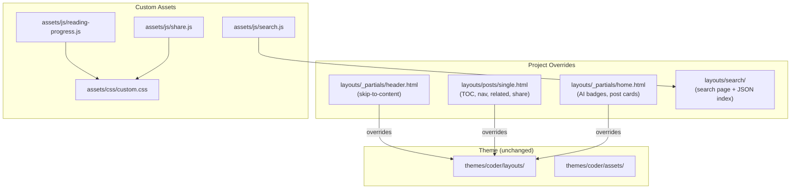

# ADR-0002: Standard Blog Features — Accessibility, UX, and Discoverability Enhancements

**Date**: 2026-02-22
**Status**: Accepted
**Deciders**: Alex Djalali

## Context

The blog launched with core content and Hugo Coder theme defaults, but lacked standard features expected on modern blogs: accessibility shortcuts, performance optimizations, content discoverability, and reader engagement tools. These are table-stakes features that improve usability without changing the site's visual identity or architecture.

Specific gaps identified:
- No skip-to-content link for keyboard/screen-reader users
- Images loaded eagerly, slowing initial page load
- No table of contents for long posts
- No reading progress indicator
- No post navigation (previous/next)
- No related posts suggestions
- No social share buttons
- No client-side search

## Decision

Add a cohesive set of standard blog features via Hugo layout overrides and custom JavaScript/CSS, keeping all customizations in the project's `layouts/` and `assets/` directories (never modifying the theme submodule).

### Features Added

| Feature | Implementation | Files |
|---------|---------------|-------|
| Skip-to-content | Hidden anchor link in header | `layouts/_partials/header.html` |
| Lazy images | `loading="lazy"` on `` tags via render hook | `layouts/_default/_markup/render-image.html` |
| Table of contents | Hugo's built-in `.TableOfContents` in single post layout | `layouts/posts/single.html` |
| Reading progress | Scroll-based progress bar via JS | `assets/js/reading-progress.js`, `assets/css/custom.css` |
| Post navigation | Previous/next links at bottom of posts | `layouts/posts/single.html` |
| Related posts | Hugo's `.Site.RegularPages.Related` | `layouts/posts/single.html` |
| Share buttons | JS-driven social share (Twitter, LinkedIn, email) | `assets/js/share.js`, `layouts/posts/single.html` |
| Client-side search | JSON index + JS search against title/content/tags | `assets/js/search.js`, `content/search/_index.md`, `layouts/search/` |
| AI badge | Per-post badge indicating AI assistance level | `layouts/_partials/home.html`, `content/ai-disclaimer.md` |

### Design Principles

- **Progressive enhancement**: All features degrade gracefully without JS
- **No external dependencies**: No third-party JS libraries (search is vanilla JS against a Hugo-generated JSON index)
- **Theme-safe**: All changes in project `layouts/` and `assets/`, never in `themes/`
- **Minimal footprint**: Each feature is a small, self-contained file

## Alternatives Considered

| Alternative | Pros | Cons |
|-------------|------|------|
| **A: Project-level layout overrides + custom JS** (chosen) | Clean separation from theme; each feature isolated; no build toolchain changes | Must maintain layout overrides if theme updates upstream templates |
| **B: Fork the Coder theme and add features directly** | Single source of truth; no override files | Breaks theme updates; maintains a fork; violates submodule pattern |
| **C: Use Hugo modules/plugins for each feature** | Community-maintained; less custom code | Dependency on external modules; version compatibility concerns; less control |
| **D: Use Pagefind for search instead of custom JS** | Better search quality; handles large sites | External build dependency; overkill for a small personal blog |

## Architecture Diagram

> Hugo resolves layouts from project `layouts/` before `themes/coder/layouts/`. Project-level partials and single templates override the theme's versions while the theme remains untouched.

## Consequences

### Positive
- Improved accessibility (skip-to-content, semantic HTML)
- Faster page loads (lazy images)
- Better content discoverability (search, related posts, TOC)
- Reader engagement tools (share buttons, reading progress)
- Transparent AI attribution (AI badges)

### Negative
- Layout overrides must be maintained if the Coder theme updates its base templates
- Custom JS adds to page weight (mitigated by small file sizes and minification)
- Client-side search quality is limited compared to server-side solutions

### Risks
- Theme template updates may diverge from project overrides, requiring manual reconciliation
- Search JSON index grows linearly with content volume (acceptable for a personal blog)

## Implementation Notes

- **Files created**: 8 new files across `layouts/`, `assets/js/`, `assets/css/`, `content/`
- **Files affected**: None modified in theme
- **Testing strategy**: `hugo --minify` build succeeds; manual verification of each feature in browser
- **Rollback plan**: Delete project-level layout overrides to revert to theme defaults

## Quality Checklist

### Architecture & Design

- [x] ADR addresses a real architectural concern (not a trivial implementation detail)
- [x] Alternatives section has at least 2 genuine options
- [x] Consequences section is honest about trade-offs
- [x] Implementation notes include a testing strategy
- [x] Architecture diagram accurately reflects the change

### Coding Patterns (consider which apply to the decision)

- [ ] **Fluent Interface** — N/A
- [ ] **Builder Pattern** — N/A
- [ ] **DRY** — N/A
- [ ] **Decorator Pattern** — N/A
- [ ] **Strategy Pattern** — N/A
- [x] **Observer Pattern** — Reading progress uses scroll event listener
- [ ] **Singleton Pattern** — N/A
- [x] **Facade Pattern** — Search module provides a simple interface over JSON index querying

### Implementation Readiness

- [x] Decision is clear enough for an implementer unfamiliar with the codebase
- [x] Affected files/modules are identified
- [x] Testing strategy covers unit, integration, and edge cases
- [x] Rollback plan is defined (if applicable)
- [x] Documentation requirements are identified
