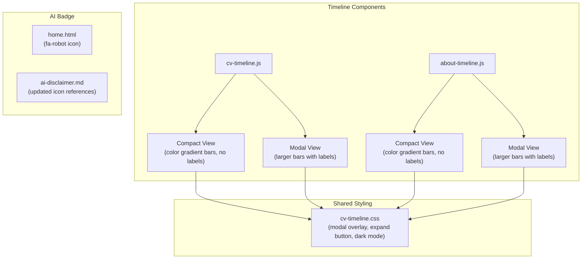

# ADR-0003: Timeline Components — Modal Expansion and Color Gradient Refinements

**Date**: 2026-02-23
**Status**: Proposed
**Deciders**: Alex Djalali

## Context

The CV and About pages feature D3.js-powered interactive timeline charts that visualize career and life events as horizontal swim-lane bars. The initial implementation used:
- Inline bar labels that were often clipped or hidden when bars were too narrow
- A static job/education color legend with two fixed colors (`#333` for jobs, `#999` for education)
- Thumbs-up/thumbs-down icons for the AI assistance badge on blog posts

These had usability issues:
1. **Bar labels**: On narrow viewports or short time spans, labels were removed entirely, making bars unidentifiable without hovering
2. **Color scheme**: The binary job/education coloring lost information — all jobs looked identical, all education looked identical
3. **AI badge icons**: Thumbs-up/down implied value judgment rather than neutral disclosure

## Decision

### Timeline Modal Expansion

Replace inline bar labels with an "Expand Timeline" button that opens a full-viewport modal containing a larger version of the timeline. The modal uses wider lanes (`36px` vs `28px`), fits labels inside bars, and supports:
- Click-to-close (backdrop click, Escape key, close button)
- Tooltips on hover
- Click-to-scroll to the corresponding CV entry (CV timeline only)

### Sequential Color Gradient

Replace the binary job/education color scheme with a sequential HSL gradient from light red to dark red. Each bar gets a unique color based on its index in the dataset, making individual entries visually distinguishable. The gradient adapts to dark mode (lighter tones for dark backgrounds).

| Mode | Start Color | End Color |
|------|------------|-----------|
| Light | `#f4a5a5` (soft red) | `#7b1a1a` (dark maroon) |
| Dark | `#ef9a9a` (light red) | `#c0392b` (medium red) |

### AI Badge Icon Change

Replace `fa-thumbs-up` / `fa-thumbs-down` with a neutral `fa-robot` icon for both AI-assisted and non-AI-assisted posts. Color differentiates: blue (`#2980b9`) for AI-assisted, gray (`#bbb`) for non-AI-assisted.

## Alternatives Considered

| Alternative | Pros | Cons |
|-------------|------|------|
| **A: Modal expansion + color gradient** (chosen) | Labels always visible in modal; individual bars distinguishable; clean compact view by default | More JS complexity; modal UX pattern to maintain |
| **B: Responsive label truncation** | Simpler implementation; no modal needed | Still clips on mobile; doesn't solve color distinction |
| **C: Sidebar legend with scroll-linked highlighting** | No modal needed; always visible | Takes horizontal space; complex scroll synchronization |
| **D: Keep labels, reduce font size dynamically** | Minimal code change | Unreadable at small sizes; inconsistent appearance |

## Architecture Diagram

## Consequences

### Positive
- Timeline bars always identifiable (via modal labels or hover tooltips)
- Individual career entries visually distinct through gradient coloring
- Modal provides a focused, detailed view without cluttering the compact timeline
- AI badge is neutral — no implied judgment about AI assistance
- Removed legend reduces visual clutter in compact view

### Negative
- Modal adds JS complexity (~170 lines per timeline file)
- Some code duplication between compact and modal rendering (mitigated by shared helper functions)
- Color gradient loses the at-a-glance job vs. education distinction

### Risks
- Modal z-index conflicts with other page elements (mitigated by using z-index 10000+)
- D3.js version updates could break modal rendering (mitigated by pinning D3 version)

## Implementation Notes

- **Files modified**: `assets/js/cv-timeline.js`, `assets/js/about-timeline.js`, `assets/css/cv-timeline.css`, `layouts/_partials/home.html`, `content/ai-disclaimer.md`
- **Files removed**: Legend CSS classes (`.timeline-legend`, `.legend-swatch`), bar label classes (`.bar-label`, `.bar-rect.job`, `.bar-rect.education`)
- **Testing strategy**: `hugo --minify` build succeeds; manual verification of modal open/close, tooltip behavior, color rendering in light and dark mode
- **Rollback plan**: `git checkout HEAD -- assets/js/ assets/css/ layouts/ content/ai-disclaimer.md`

## Quality Checklist

### Architecture & Design

- [x] ADR addresses a real architectural concern (not a trivial implementation detail)
- [x] Alternatives section has at least 2 genuine options
- [x] Consequences section is honest about trade-offs
- [x] Implementation notes include a testing strategy
- [x] Architecture diagram accurately reflects the change

### Coding Patterns (consider which apply to the decision)

- [ ] **Fluent Interface** — N/A
- [ ] **Builder Pattern** — N/A
- [x] **DRY** — Shared helper functions (`assignLanes`, `getColorScale`, tooltip handlers) reused between compact and modal views
- [ ] **Decorator Pattern** — N/A
- [ ] **Strategy Pattern** — N/A
- [x] **Observer Pattern** — Event listeners for modal close (Escape, backdrop click), scroll-triggered fade-in
- [ ] **Singleton Pattern** — N/A
- [x] **Facade Pattern** — `openModal()` encapsulates all modal creation, rendering, and teardown logic

### Implementation Readiness

- [x] Decision is clear enough for an implementer unfamiliar with the codebase
- [x] Affected files/modules are identified
- [x] Testing strategy covers unit, integration, and edge cases
- [x] Rollback plan is defined (if applicable)
- [x] Documentation requirements are identified
