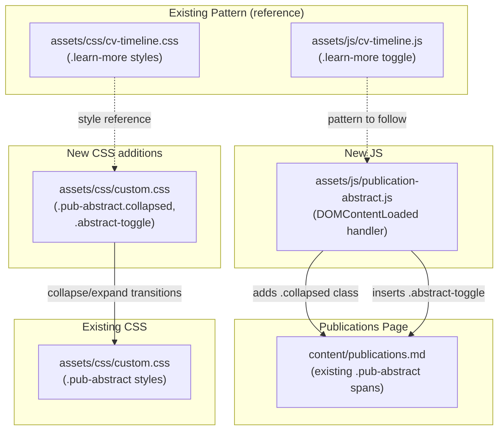

# ADR-0004: Publication Abstract Toggle — Collapsible Inline Abstracts

**Date**: 2026-02-23
**Status**: Accepted
**Deciders**: Alex Djalali

## Context

The publications page (`content/publications.md`) displays 15 journal articles, conference papers, a dissertation, and 9 patents. Each entry already contains an inline abstract wrapped in ``, currently rendered as always-visible italic text below the citation.

With 25+ entries each showing multi-sentence abstracts, the page is very long and difficult to scan. Readers looking for a specific paper must scroll past walls of abstract text. The CV page already solves an analogous problem — each experience entry has a "Learn More" button that toggles a `.description.collapsed` div with a smooth CSS max-height transition. The publications page should use the same interaction pattern: abstracts hidden by default, revealed per-entry via an "Abstract" button.

## Decision

Add a collapsible abstract toggle to the publications page, following the CV page's "Learn More" pattern:

### Interaction

1. All `.pub-abstract` spans start hidden (collapsed) on page load
2. An "Abstract" button appears after each citation's BibTeX link
3. Clicking "Abstract" expands the abstract with a CSS transition; button text changes to "Hide abstract"
4. Clicking "Hide abstract" collapses it back
5. Each entry toggles independently

### Implementation Approach

Use a small vanilla JS file (`assets/js/publication-abstract.js`) that runs on `DOMContentLoaded`:

1. Query all `.pub-abstract` elements
2. Add a `collapsed` class to each (hiding them by default)
3. Insert an `<a class="abstract-toggle">Abstract</a>` button after the BibTeX link (or at the end of the `<li>` if no BibTeX link)
4. Attach a click handler that toggles `collapsed` and updates button text

### CSS

Reuse the existing `.pub-abstract` styles and add collapse/expand transitions modeled on `.cv-entry .description.collapsed`:

- `.pub-abstract.collapsed` — `max-height: 0; overflow: hidden; opacity: 0`
- `.pub-abstract:not(.collapsed)` — `max-height: 600px; opacity: 1` with ease transitions
- `.abstract-toggle` — styled identically to `.learn-more` button from the CV page

### Print / No-JS Behavior

- In print media (`@media print`): abstracts always visible, toggle button hidden (same as CV's `.learn-more` print rule)
- Without JS: abstracts remain visible (the `collapsed` class is added by JS, so the static HTML shows abstracts by default — progressive enhancement)

## Alternatives Considered

| Alternative | Pros | Cons |
|-------------|------|------|
| **A: Per-entry "Abstract" toggle button** (chosen) | Matches CV "Learn More" pattern; progressive enhancement; each entry independent; familiar UX | Adds JS file; each entry needs click |
| **B: Global "Show/Hide All Abstracts" toggle** | Single click for all; simpler JS | Can't selectively read one abstract; all-or-nothing is less useful for scanning |
| **C: Hover-to-reveal tooltip** | No click needed; compact | Touch devices have no hover; long abstracts don't fit tooltips; no persistent view |
| **D: Abstracts on separate page/modal per publication** | Keeps page very clean | Breaks reading flow; extra navigation; overkill for short text |

## Architecture Diagram

> The new JS file follows the same progressive-enhancement pattern as the CV timeline: the static HTML works without JS (abstracts visible), and JS adds the toggle behavior on load.

## Consequences

### Positive
- Publications page becomes scannable — readers see citations first, expand abstracts on demand
- Consistent UX with the CV page's "Learn More" pattern
- Progressive enhancement — no-JS browsers see all abstracts (current behavior preserved)
- Print styles show all abstracts (no information lost in printed version)
- No changes to `content/publications.md` — existing `pub-abstract` spans are used as-is

### Negative
- One more JS file to load on the publications page
- Readers must click to see each abstract (minor friction for those who want to read all)

### Risks
- If `pub-abstract` class name changes in the content, the JS selector breaks (low risk — the class is in author-controlled Markdown)
- CSS max-height transition has a hard upper bound (`600px`) — abstracts taller than this would clip (mitigated by choosing a generous value; longest current abstract is ~5 lines)

## Implementation Notes

- **Files to create**: `assets/js/publication-abstract.js`
- **Files to modify**: `assets/css/custom.css` (add `.pub-abstract.collapsed`, `.abstract-toggle` styles)
- **Files to modify**: Hugo template or `content/publications.md` (add `<script>` reference if not auto-included)
- **No changes to content**: The existing `` elements are the toggle targets — no Markdown edits needed
- **Pattern reference**: `assets/js/cv-timeline.js:286-301` — the "Learn More" toggle implementation
- **Style reference**: `assets/css/cv-timeline.css:239-280` — the `.learn-more` button styling
- **Testing strategy**:
  - `hugo --minify` build succeeds
  - Publications page loads with all abstracts collapsed
  - Clicking "Abstract" expands the correct entry
  - Clicking "Hide abstract" collapses it
  - Verify dark mode toggle button styling
  - Verify print media shows all abstracts
  - Verify no-JS fallback (disable JS, abstracts visible)
- **Rollback plan**: Delete `assets/js/publication-abstract.js` and remove CSS additions

## Quality Checklist

### Architecture & Design

- [x] ADR addresses a real architectural concern (not a trivial implementation detail)
- [x] Alternatives section has at least 2 genuine options
- [x] Consequences section is honest about trade-offs
- [x] Implementation notes include a testing strategy
- [x] Architecture diagram accurately reflects the change

### Coding Patterns (consider which apply to the decision)

- [ ] **Fluent Interface** — N/A
- [ ] **Builder Pattern** — N/A
- [x] **DRY** — Reuses existing `.pub-abstract` class and follows `.learn-more` pattern; toggle styling shared via similar CSS
- [ ] **Decorator Pattern** — N/A
- [ ] **Strategy Pattern** — N/A
- [x] **Observer Pattern** — Click event listener on dynamically inserted toggle buttons
- [ ] **Singleton Pattern** — N/A
- [ ] **Facade Pattern** — N/A

### Implementation Readiness

- [x] Decision is clear enough for an implementer unfamiliar with the codebase
- [x] Affected files/modules are identified
- [x] Testing strategy covers unit, integration, and edge cases
- [x] Rollback plan is defined (if applicable)
- [x] Documentation requirements are identified
