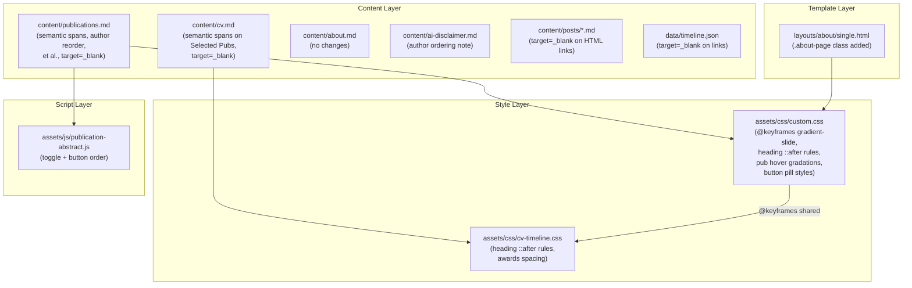

# ADR-0005: Publication & Site-Wide UI Refinements

**Date**: 2026-02-23
**Status**: Accepted
**Deciders**: Alex Djalali

## Context

After implementing the publication abstract toggle (ADR-0004), several related UI improvements were needed across the site:

1. **Publication citations lack semantic structure** — Each `<li>` in the publications list was a flat block of text. There was no way to style authors, titles, and publication details independently, and no hover feedback to help readers scan entries.

2. **External links open in the same tab** — Raw HTML links in content pages (`publications.md`, `cv.md`, blog posts) and JSON data files (`timeline.json`) lacked `target="_blank"`, causing users to navigate away from the site when clicking external links.

3. **Section header underlines are static** — All `<h2>` section headers across the CV, Publications, About, and blog post pages used `border-bottom: 2px solid #000`, a flat black line with no visual interest or brand cohesion.

4. **CV page spacing issues** — Awards timeline items under Honors lacked indentation and vertical spacing. Selected Publications entries were packed too tightly.

5. **Author ordering and condensation** — Publication entries listed authors in print-canonical order, which varied. A personal site benefits from consistent self-first ordering and condensed author lists for readability.

## Decision

### 1. Semantic Citation Markup

Wrap each publication entry in three `<span>` elements with distinct classes:

- `<span class="pub-authors">` — Author names
- `<span class="pub-title">` — Title (quoted, often linked)
- `<span class="pub-extra">` — Venue, journal, year

Apply three-tier red hover gradations on `.cv-list li:hover`:
- Authors: `#e74c3c` (light red)
- Title: `#c0392b` (medium red)
- Extra: `#922b21` (dark red)

Dark mode variants use lighter reds (`#f1948a`, `#e74c3c`, `#cd6155`).

### 2. Unified BibTeX/Abstract Button Styling

Both buttons share a pill-shaped base style (`font-size: 0.8em`, `padding: 0.2em 0.6em`, `border-radius: 4px`) with distinct colors:
- BibTeX: blue (`#2471a3` light, `#5dade2` dark)
- Abstract: red (`#c0392b` light, `#e74c3c` dark)

Button order: Abstract first, BibTeX second.

### 3. External Link Audit

All external `<a>` tags in raw HTML across content and data files receive `target="_blank" rel="noopener noreferrer"`. Markdown links are already handled by the Hugo Coder theme's `render-link.html` hook.

### 4. Animated Gradient Header Underlines

Replace all static `border-bottom: 2px solid` on section headers with a `::after` pseudo-element carrying an animated red gradient:

```css
background: linear-gradient(90deg,
  #000 0%, #922b21 20%, #c0392b 35%, #e74c3c 50%,
  #c0392b 65%, #922b21 80%, #000 100%);
background-size: 200% 100%;
animation: gradient-slide 3s linear infinite;
```

Applied to:
- `.content .page h1.title` — All content page titles (Publications, AI Disclaimer, etc.)
- `.cv-page > article > h2` — CV page top-level headings (Resume, Timeline)
- `.cv-section h2` — CV section headings (Experience, Education, Honors, Selected Publications)
- `.cv-skills h2`, `.cv-research h2` — CV Technologies and Research sections
- `.tech-section h2` — Technologies heading (moved from `border-top` on container to `::after` below heading)
- `.about-page h2`, `.about-page h3` — About page headings
- `.post h2` — Blog post subheadings

Dark mode uses lighter red gradient (`#ddd` → `#cd6155` → `#e74c3c` → `#f1948a`).

### 5. CV Page Spacing

- Awards: `.honors-group .cv-list { margin-left: 1.2em }` and `.honors-group .cv-list li { margin-bottom: 0.45em }`
- Selected Publications: `.cv-list li { margin-bottom: 0.4em }`

### 6. Author Ordering & Condensation

- All 25 publication entries list `Djalali, AJ` first for navigability
- Entries with 3+ authors condensed to "Djalali, AJ et al."
- AI disclaimer page updated with a note explaining that author order on the site does not reflect print-canonical order

## Alternatives Considered

| Alternative | Pros | Cons |
|-------------|------|------|
| **A: CSS pseudo-element animated gradient** (chosen) | Pure CSS, no JS; works on all pages; smooth infinite loop; respects `prefers-reduced-motion` | Requires `::after` on every header selector; gradient definitions repeated across selectors |
| **B: CSS border-image with gradient** | Simpler (no pseudo-element needed) | `border-image` doesn't support `background-size` animation; no smooth slide effect possible |
| **C: JavaScript-driven header animation** | More control over timing and effects | Unnecessary complexity for a pure visual effect; JS dependency for cosmetic styling |
| **D: Static colored border (no animation)** | Simplest implementation | No visual dynamism; doesn't create the brand accent effect |

## Architecture Diagram



## Consequences

### Positive
- Publications are scannable with clear visual hierarchy on hover (authors → title → venue)
- Consistent animated accent across all section headers reinforces brand identity
- External links never navigate away from the site
- CV page awards and publications have improved readability with proper spacing
- Author-first ordering makes the publications page function as a personal portfolio
- Reduced motion is respected via existing `prefers-reduced-motion: reduce` rule in `custom.css`

### Negative
- Animated gradient adds visual motion that some users may find distracting (mitigated by `prefers-reduced-motion`)
- Repeated gradient definitions across multiple selectors in two CSS files (mitigated by consistent copy-paste pattern)
- Author reordering means the site does not reflect print-canonical author order (mitigated by explicit disclaimer)

### Risks
- `::after` pseudo-elements on headers could conflict with other styling that uses `::after` (low risk — no existing header `::after` usage found)
- `prefers-reduced-motion` fallback relies on the existing blanket rule at the top of `custom.css` — if that rule is removed, animations would persist for motion-sensitive users

## Implementation Notes

- **Files created**: `assets/js/publication-abstract.js`
- **Files modified**:
  - `assets/css/custom.css` — `@keyframes gradient-slide`, heading `::after` rules (page titles, about page, blog posts, tech section), publication hover gradations, button pill styles
  - `assets/css/cv-timeline.css` — heading `::after` rules (cv-section, cv-skills, cv-research, cv-page), awards spacing, dark mode overrides
  - `layouts/about/single.html` — Added `.about-page` class
  - `content/publications.md` — Semantic spans, author reordering, et al., `target="_blank"`
  - `content/cv.md` — Semantic spans on Selected Publications, `target="_blank"`
  - `content/ai-disclaimer.md` — Author ordering disclaimer
  - `content/posts/dependency-to-lambda.md` — `target="_blank"` on HTML links
  - `data/timeline.json` — `target="_blank"` on embedded HTML links
  - `hugo.toml` — Registered `publication-abstract.js` in `customJS`
- **Testing strategy**: `hugo server` live reload; verify gradient animation on all pages; verify hover gradations on publications; verify external links open in new tabs; verify dark mode variants; verify print styles
- **Rollback plan**: `git revert` the commit

## Quality Checklist

### Architecture & Design

- [x] ADR addresses a real architectural concern (not a trivial implementation detail)
- [x] Alternatives section has at least 2 genuine options
- [x] Consequences section is honest about trade-offs
- [x] Implementation notes include a testing strategy
- [x] Architecture diagram accurately reflects the change

### Coding Patterns (consider which apply to the decision)

- [ ] **Fluent Interface** — N/A
- [ ] **Builder Pattern** — N/A
- [x] **DRY** — `@keyframes gradient-slide` defined once in `custom.css`, reused by all gradient references including `cv-timeline.css`
- [ ] **Decorator Pattern** — N/A
- [ ] **Strategy Pattern** — N/A
- [x] **Observer Pattern** — Click event listeners on abstract toggle buttons; hover-triggered CSS gradations
- [ ] **Singleton Pattern** — N/A
- [ ] **Facade Pattern** — N/A

### Implementation Readiness

- [x] Decision is clear enough for an implementer unfamiliar with the codebase
- [x] Affected files/modules are identified
- [x] Testing strategy covers unit, integration, and edge cases
- [x] Rollback plan is defined (if applicable)
- [x] Documentation requirements are identified
