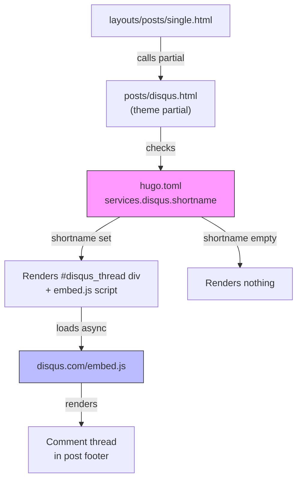

# ADR-0006: Disqus Comments Integration

**Date**: 2026-02-25
**Status**: Accepted
**Deciders**: a.j.djalali

## Context

The blog has no commenting system enabled. Reader engagement is limited to social sharing buttons (Twitter/X, LinkedIn, copy link). The Hugo Coder theme already ships with a complete Disqus partial (`themes/coder/layouts/_partials/posts/disqus.html`) that is gated behind a config value, and the post template (`layouts/posts/single.html:69`) already calls it. Enabling Disqus requires only a configuration change.

Disqus's Basic (free) plan requires displaying ads, but personal non-commercial blogs qualify for an ad-free exception.

## Decision

Enable Disqus comments by setting `services.disqus.shortname` in `hugo.toml`. Use the existing theme partial as-is — it already handles:

- Async embed script loading
- Localhost detection (placeholder message in dev)
- Per-page identifier/title/URL via frontmatter
- Dark/light theme switching via `themeChanged` event + `DISQUS.reset`
- Per-post opt-out via `disableComments: true` frontmatter

No custom partial override or additional JavaScript is needed.

## Alternatives Considered

| Alternative | Pros | Cons |
|-------------|------|------|
| **Disqus (chosen)** | Zero custom code — theme has full support; mature moderation tools; spam filtering; social login | Third-party dependency; ads on free plan (waivable for personal blogs); loads external JS |
| **Giscus** (GitHub Discussions) | No ads; open source; theme partial exists | Requires GitHub account to comment; limits audience to technical users |
| **Utterances** (GitHub Issues) | Lightweight; no ads; theme partial exists | Same GitHub-only limitation; clutters repo issues |
| **Cusdis** | Lightweight; privacy-focused; self-hostable | Requires self-hosting or paid plan; less mature |
| **No comments** | No external dependencies; no privacy concerns | No reader engagement mechanism |

## Architecture Diagram

## Consequences

### Positive
- Reader engagement via comments on all posts
- Zero custom code — leverages existing theme infrastructure
- Moderation dashboard, spam filtering, and social login out of the box
- Per-post opt-out available via frontmatter

### Negative
- External JavaScript dependency (Disqus embed.js loaded from CDN)
- Comments data lives on Disqus servers, not in the repo
- If CSP is enabled in the future, Disqus domains must be whitelisted

### Risks
- Disqus could change free-tier terms (mitigation: theme also supports Giscus, Utterances, Commento, Cusdis — switching is a config change)

## Implementation Notes

- **Change**: Add `[services.disqus] shortname = "alexdjalali"` to `hugo.toml`
- **Files affected**: `hugo.toml` only (1 line)
- **Testing**: Run `hugo server`, navigate to any post, verify comment thread loads; verify localhost placeholder message appears in dev
- **Rollback**: Remove or comment out the `[services.disqus]` section — partial renders nothing when shortname is empty
