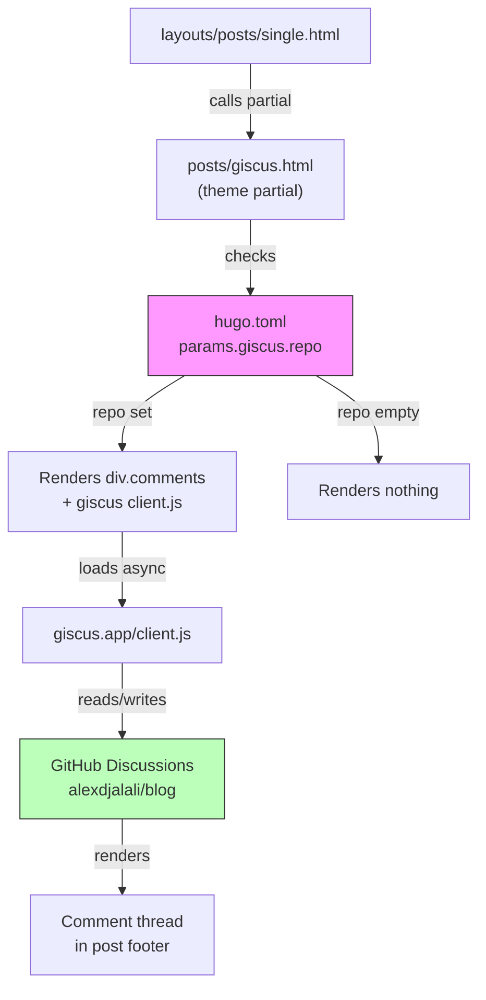

# ADR-0006: Giscus Comments Integration

**Date**: 2026-02-25
**Status**: Accepted
**Deciders**: a.j.djalali

## Context

The blog has no commenting system enabled. Reader engagement is limited to social sharing buttons (Twitter/X, LinkedIn, copy link). The Hugo Coder theme ships with partials for multiple comment systems (Disqus, Giscus, Utterances, Commento, Cusdis), all gated behind config values. The post template (`layouts/posts/single.html:72`) already calls the Giscus partial.

Disqus was initially evaluated but its free tier requires displaying ads (unless granted an exception), and the Trusted Domains configuration caused loading failures on GitHub Pages. Giscus is a better fit: free, ad-free, open source, and uses GitHub Discussions as the backend — aligning naturally with a GitHub Pages-hosted blog.

## Decision

Enable Giscus comments by adding `[params.giscus]` configuration to `hugo.toml`. Use the existing theme partial (`themes/coder/layouts/_partials/posts/giscus.html`) as-is — it handles:

- Async script loading from `giscus.app/client.js`
- Dark/light theme detection via `localStorage` colorscheme
- Configurable mapping (pathname), reactions, input position, and language
- Per-post opt-out via `disableComments: true` frontmatter
- Lazy loading

Comments are stored as GitHub Discussions in the `alexdjalali/blog` repo under the Announcements category.

## Alternatives Considered

| Alternative | Pros | Cons |
|-------------|------|------|
| **Giscus (chosen)** | Free; no ads; open source; theme partial exists; data lives in GitHub repo; reactions support | Requires GitHub account to comment |
| **Disqus** | Mature moderation; spam filtering; social login | Ads on free plan; Trusted Domains issues on GitHub Pages; data on third-party servers |
| **Utterances** (GitHub Issues) | Lightweight; no ads; theme partial exists | Clutters repo issues; no reactions |
| **Cusdis** | Privacy-focused; lightweight (~5 KB) | Requires self-hosting or paid plan |
| **No comments** | No external dependencies | No reader engagement |

## Architecture Diagram

## Consequences

### Positive
- Reader engagement via comments on all posts
- Zero custom code — leverages existing theme partial
- Comments stored as GitHub Discussions — portable, searchable, version-controlled
- No ads, no tracking, no third-party data storage
- Reactions (emoji) support out of the box
- Theme-aware (auto light/dark mode)

### Negative
- Commenters must have a GitHub account (acceptable for a technical/academic blog)
- External JavaScript dependency (giscus.app client.js)

### Risks
- Giscus.app service could go down (mitigation: self-hostable; also can switch to Utterances or Disqus via config change)

## Implementation Notes

- **Change**: Add `[params.giscus]` section to `hugo.toml` with repo, repoID, category, categoryID
- **Prerequisite**: GitHub Discussions enabled on `alexdjalali/blog` repo
- **Files affected**: `hugo.toml` only
- **Testing**: Run `hugo server` — Giscus won't load on localhost (CORS), verify in production after deploy
- **Rollback**: Remove the `[params.giscus]` section — partial renders nothing when repo is empty
