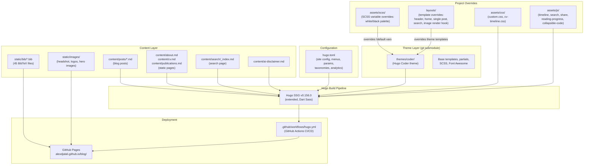
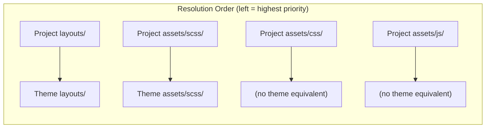
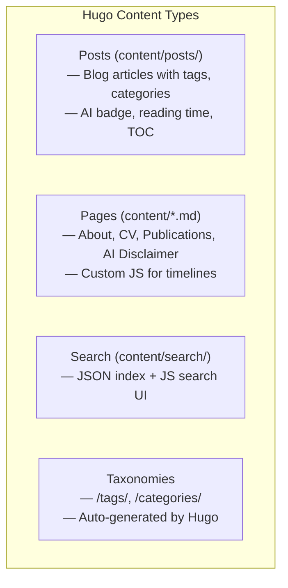
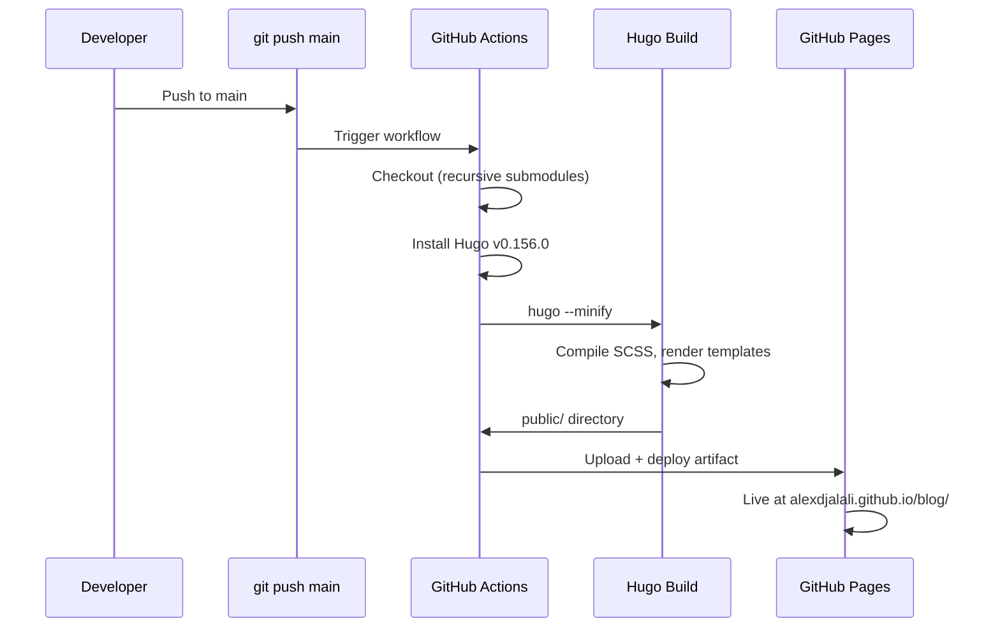

# Blog Architecture Overview

## System Architecture

## Override Strategy

Hugo resolves files in project directories before the theme. This project uses three override layers:

| Layer | Purpose | Files |
|-------|---------|-------|
| **SCSS Overrides** | White/black color palette via `!default` variable precedence | `assets/scss/coder.scss`, `assets/scss/_variables.scss` |
| **Layout Overrides** | Custom templates for header, home, single post, search | `layouts/_partials/`, `layouts/posts/`, `layouts/search/` |
| **Custom Assets** | Feature-specific JS and CSS (not overriding theme) | `assets/js/*.js`, `assets/css/*.css` |

## Content Types

## Deployment Pipeline

## Interactive Components

| Component | Technology | Files | Page |
|-----------|-----------|-------|------|
| CV Timeline | D3.js + vanilla JS | `cv-timeline.js`, `cv-timeline.css` | `/cv/` |
| About Timeline | D3.js + vanilla JS | `about-timeline.js`, `cv-timeline.css` | `/about/` |
| Client-side Search | Vanilla JS + Hugo JSON output | `search.js`, `layouts/search/` | `/search/` |
| Reading Progress | Vanilla JS scroll listener | `reading-progress.js` | All posts |
| Collapsible Code | Vanilla JS | `collapsible-code.js` | All posts |
| Share Buttons | Vanilla JS | `share.js` | All posts |
| Clickable Lists | Vanilla JS | `clickable-list.js` | Publications |
