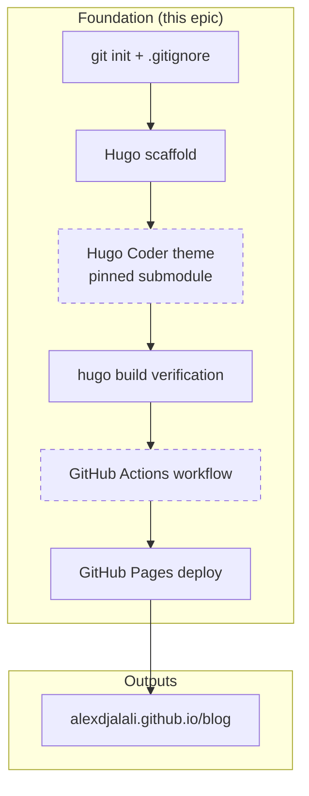

# Epic 1 — Project Foundation & Deployment Pipeline

**Status**: Planning **Stories**: 1.1--1.3 **Points**: 8

## Summary

Initialize the blog project infrastructure: git repository with public-repo safety (noreply email), Hugo installation with version pinning, Hugo Coder theme as a pinned git submodule, GitHub Actions CI/CD workflow, and an initial deployment to GitHub Pages. Validates the entire build-deploy pipeline before any content or configuration work begins.

## Architecture Diagram

## Stories

| #   | Story                                     | File                                                      |
| --- | ----------------------------------------- | --------------------------------------------------------- |
| 1.1 | Initialize git repository and install Hugo | [1.1-init-git-and-hugo.md](../stories/1.1-init-git-and-hugo.md) |
| 1.2 | Scaffold Hugo site and install theme       | [1.2-scaffold-site-and-theme.md](../stories/1.2-scaffold-site-and-theme.md) |
| 1.3 | Set up GitHub Actions and deploy           | [1.3-github-actions-deploy.md](../stories/1.3-github-actions-deploy.md) |

## Key Changes

- Git repository initialized with `.gitignore` and noreply email
- Hugo extended edition installed via Homebrew
- Hugo site scaffolded with `hugo new site . --force`
- Hugo Coder theme added as git submodule pinned to a known-good commit
- GitHub Actions workflow using official Hugo deploy approach
- GitHub repo `alexdjalali/blog` created and first deployment verified
- Base URL: `https://alexdjalali.github.io/blog/`

## Dependencies

- Homebrew available (confirmed)
- GitHub CLI authenticated as `alexdjalali` (confirmed)

## Risks

| Risk | Likelihood | Impact | Mitigation |
|------|-----------|--------|------------|
| Hugo version incompatibility with theme | Medium | High | Pin Hugo version, verify build before proceeding |
| Theme main branch has breaking changes | Medium | High | Pin submodule to specific commit SHA |
| GitHub Pages source not set to Actions | Medium | Medium | Explicit `gh api` step to configure Pages source |
