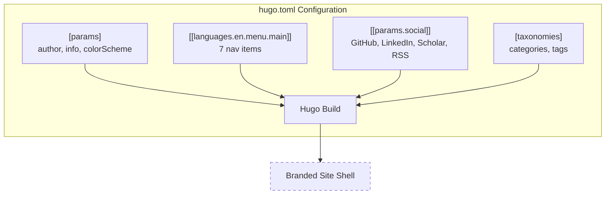

# Epic 2 — Site Configuration

**Status**: Planning **Stories**: 2.1--2.3 **Points**: 7

## Summary

Configure the Hugo site identity, navigation, social links, and taxonomies in `hugo.toml`. This epic transforms the minimal scaffold from Epic 1 into a fully branded site shell matching blog.martisak.se's layout patterns — author info, 7-item navigation menu, social link icons, dark/light mode toggle, Creative Commons license, and tag/category taxonomies.

## Architecture Diagram

## Stories

| #   | Story                                  | File                                                            |
| --- | -------------------------------------- | --------------------------------------------------------------- |
| 2.1 | Configure site identity and display    | [2.1-site-identity.md](../stories/2.1-site-identity.md)             |
| 2.2 | Configure navigation and social links  | [2.2-navigation-and-social.md](../stories/2.2-navigation-and-social.md) |
| 2.3 | Configure taxonomies                   | [2.3-configure-taxonomies.md](../stories/2.3-configure-taxonomies.md) |

## Key Changes

- `hugo.toml` populated with author, description, keywords, info tagline
- Color scheme set to "auto" with dark/light toggle
- CC BY-SA-4.0 license in footer
- Navigation menu: Home, Publications, Posts, Categories, Tags, About, CV
- Social links: GitHub, LinkedIn, Google Scholar, RSS (with Font Awesome icons)
- Taxonomies: `category` and `tag` only (no `series` or `author`)

## Dependencies

- Epic 1 complete (Hugo site scaffolded, theme installed)

## Risks

| Risk | Likelihood | Impact | Mitigation |
|------|-----------|--------|------------|
| Font Awesome icon classes changed in theme | Medium | Medium | Verify icons render after configuration |
| Menu format mismatch (generic vs language-specific) | Medium | High | Use `[[languages.en.menu.main]]` format exclusively |
| Multi-word taxonomy bug in Hugo Coder (#980) | Medium | Low | Use single-word tags initially |
