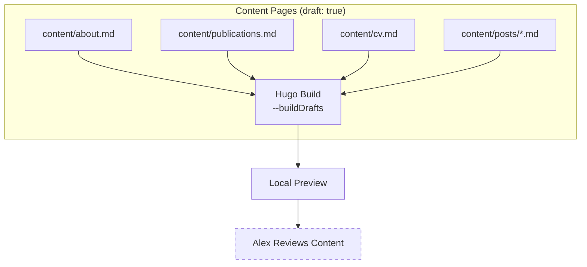

# Epic 3 — Content Creation

**Status**: Planning **Stories**: 3.1--3.4 **Points**: 10

## Summary

Create all seed content for the blog: About page with Alex's bio, Publications page with academic work, CV page with professional history, and two sample blog posts. All content starts as `draft: true` for Alex to review before publishing. Content is sourced from publicly available information and must be verified for accuracy.

## Architecture Diagram

## Stories

| #   | Story                          | File                                                    |
| --- | ------------------------------ | ------------------------------------------------------- |
| 3.1 | Create About page with bio     | [3.1-about-page.md](../stories/3.1-about-page.md)           |
| 3.2 | Create Publications page       | [3.2-publications-page.md](../stories/3.2-publications-page.md) |
| 3.3 | Create CV page                 | [3.3-cv-page.md](../stories/3.3-cv-page.md)                 |
| 3.4 | Write sample blog posts        | [3.4-sample-blog-posts.md](../stories/3.4-sample-blog-posts.md) |

## Key Changes

- `content/about.md` — Professional bio, academic background, research interests
- `content/publications.md` — Curated list of academic publications
- `content/cv.md` — Structured CV with education, experience, skills
- `content/posts/hello-world.md` — Introductory blog post
- `content/posts/on-natural-logic.md` — Research-focused blog post
- All files use `draft: true` front matter

## Dependencies

- Epic 2 complete (navigation menu configured, taxonomies set up)
- Stories 3.1-3.3 depend on Epic 2, Story 2.1 (site identity)
- Story 3.4 depends on Story 2.3 (taxonomies configured)

## Risks

| Risk | Likelihood | Impact | Mitigation |
|------|-----------|--------|------------|
| Bio/CV content inaccuracy | Medium | Medium | All content is `draft: true`; Alex reviews before publishing |
| Publications list incomplete | High | Low | Placeholder with known publications; Alex adds missing ones |
| PII exposure concerns | Medium | Medium | Content review gate in Epic 4 before any content goes live |
