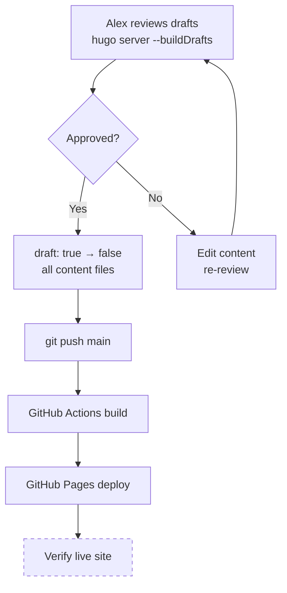

# Epic 4 — Launch & Verification

**Status**: Complete **Stories**: 4.1 **Points**: 3

## Summary

Content review gate and production launch. Alex reviews all draft content for accuracy, approves it, then all drafts are flipped to published. Final push triggers GitHub Actions deployment. Verify the live site renders correctly with all pages, navigation, social links, and taxonomy pages working.

## Architecture Diagram

## Stories

| #   | Story                              | File                                                          |
| --- | ---------------------------------- | ------------------------------------------------------------- |
| 4.1 | Content review gate and publish    | [4.1-review-and-publish.md](../stories/4.1-review-and-publish.md) |

## Key Changes

- All content files: `draft: true` → `draft: false`
- Final commit and push to trigger deployment
- Live site verification at `https://alexdjalali.github.io/blog/`

## Dependencies

- Epic 3 complete (all content created as drafts)
- Epic 1 complete (deployment pipeline functional)

## Risks

| Risk | Likelihood | Impact | Mitigation |
|------|-----------|--------|------------|
| Broken live site after deploy | Low | High | Rollback via `git revert HEAD && git push` or disable Pages |
| Content not approved by Alex | Medium | Medium | Explicit review gate — implementation pauses for approval |
