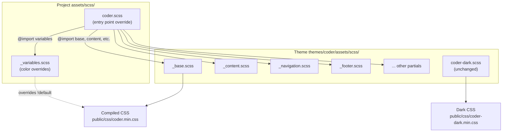

# Epic 5 — Blog Design: White/Black Academic Theme

**Status**: Complete **Stories**: 5.1--5.2 **Points**: 4

## Summary

Override the Hugo Coder theme's color palette to use pure white (`#ffffff`) background with black (`#000000`) foreground and links, matching the clean academic aesthetic of [blog.martisak.se](https://blog.martisak.se/). Implementation uses Hugo's asset pipeline to override SCSS variables at the project level without modifying the theme submodule.

**ADR**: [0001-blog-design-white-black-academic-theme.md](../../adr/0001-blog-design-white-black-academic-theme.md)

## Architecture Diagram

> Hugo's `resources.Get "scss/coder.scss"` finds the project-level entry point first. SCSS resolves `@import "variables"` relative to the importing file, picking up the project's `_variables.scss`. All other imports (base, content, navigation, etc.) fall through to the theme directory.

## Stories

| #   | Story                                          | Status | File                                                              |
| --- | ---------------------------------------------- | ------ | ----------------------------------------------------------------- |
| 5.1 | Override SCSS entry point and color variables   | Complete | [5.1-scss-color-overrides.md](../stories/5.1-scss-color-overrides.md) |
| 5.2 | Visual QA and dark mode verification            | Complete | [5.2-visual-qa.md](../stories/5.2-visual-qa.md)                  |

## Key Changes

- Create `assets/scss/coder.scss` (project-level copy of theme entry point)
- Create `assets/scss/_variables.scss` with white/black color palette
- Verify build output and visual correctness across all page types
- Confirm dark mode remains functional

## Dependencies

- None — purely additive styling change

## Risks

| Risk                                           | Likelihood | Impact | Mitigation                                             |
| ---------------------------------------------- | ---------- | ------ | ------------------------------------------------------ |
| Hugo SCSS import resolution changes in future  | Low        | Medium | Pin Hugo version; test after upgrades                  |
| Theme removes `!default` from variables        | Low        | Medium | Monitor theme releases; fork if necessary              |
| High contrast white/black harms readability    | Low        | Low    | Can soften to `#111` foreground if feedback warrants   |
| Black links lose visual affordance             | Medium     | Low    | Hover underline already present; can add underline-offset later |
