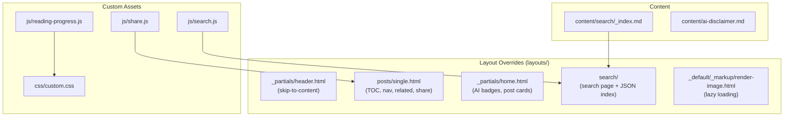

# Epic 6 — Standard Blog Features: Accessibility, UX, and Discoverability

**Status**: Complete **Stories**: 6.1--6.3 **Points**: 8

## Summary

Add standard blog features that improve accessibility, performance, content discoverability, and reader engagement. All features implemented via Hugo layout overrides and custom JS/CSS without modifying the theme submodule. Includes skip-to-content, lazy images, table of contents, reading progress, post navigation, related posts, share buttons, client-side search, and AI assistance badges.

**ADR**: [0002-standard-blog-features.md](../../adr/0002-standard-blog-features.md)

## Architecture Diagram

## Stories

| #   | Story                                          | Status   | File                                                                  |
| --- | ---------------------------------------------- | -------- | --------------------------------------------------------------------- |
| 6.1 | Accessibility and performance enhancements     | Complete | [6.1-accessibility-and-performance.md](../stories/6.1-accessibility-and-performance.md) |
| 6.2 | Content discoverability features               | Complete | [6.2-content-discoverability.md](../stories/6.2-content-discoverability.md) |
| 6.3 | Reader engagement and AI transparency          | Complete | [6.3-reader-engagement.md](../stories/6.3-reader-engagement.md)       |

## Key Changes

- Skip-to-content link for keyboard and screen-reader accessibility
- Lazy image loading via Hugo render hook
- Table of contents on long posts
- Scroll-based reading progress indicator
- Previous/next post navigation
- Related posts suggestions
- Social share buttons (Twitter, LinkedIn, email)
- Client-side search with JSON index
- AI assistance badge on each post

## Dependencies

- Epic 5 (SCSS color overrides) — completed; custom CSS builds on the established color palette

## Risks

| Risk                                             | Likelihood | Impact | Mitigation                                              |
| ------------------------------------------------ | ---------- | ------ | ------------------------------------------------------- |
| Theme template updates break layout overrides    | Medium     | Medium | Pin theme submodule; reconcile overrides on update      |
| Search JSON index grows with content             | Low        | Low    | Acceptable for personal blog scale                      |
| Custom JS conflicts with theme JS                | Low        | Medium | Each feature is self-contained with no global state     |
