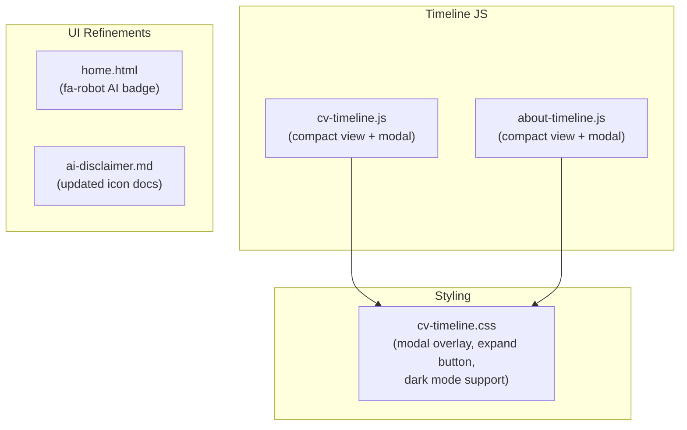

# Epic 7 — Timeline Components and UI Refinements

**Status**: Complete **Stories**: 7.1--7.2 **Points**: 5

## Summary

Refine the D3.js timeline components on the CV and About pages by replacing inline bar labels with an expandable modal view and switching from binary job/education coloring to a sequential red gradient. Also update the AI badge icon from thumbs-up/down to a neutral robot icon.

**ADR**: [0003-timeline-components-and-ui-refinements.md](../../adr/0003-timeline-components-and-ui-refinements.md)

## Architecture Diagram

## Stories

| #   | Story                                          | Status   | File                                                                  |
| --- | ---------------------------------------------- | -------- | --------------------------------------------------------------------- |
| 7.1 | Timeline modal expansion and color gradient    | Complete | [7.1-timeline-modal-and-colors.md](../stories/7.1-timeline-modal-and-colors.md) |
| 7.2 | AI badge icon update                           | Complete | [7.2-ai-badge-icon.md](../stories/7.2-ai-badge-icon.md)              |

## Key Changes

- "Expand Timeline" button opens full-viewport modal with labeled bars
- Sequential HSL color gradient replaces binary job/education coloring
- Modal supports close via backdrop click, Escape key, and close button
- Removed legend and inline bar labels from compact view
- AI badge uses neutral `fa-robot` icon with color coding (blue=AI, gray=no-AI)

## Dependencies

- Epic 6 (standard blog features) — AI badge introduced in Epic 6, refined here

## Risks

| Risk                                             | Likelihood | Impact | Mitigation                                              |
| ------------------------------------------------ | ---------- | ------ | ------------------------------------------------------- |
| Modal z-index conflicts with other elements      | Low        | Medium | Uses z-index 10000+; tested across all pages            |
| D3.js version updates break rendering            | Low        | Medium | D3 loaded from CDN with pinned version                  |
| Color gradient loses job/education distinction   | Medium     | Low    | Tooltips and modal labels provide full context           |
