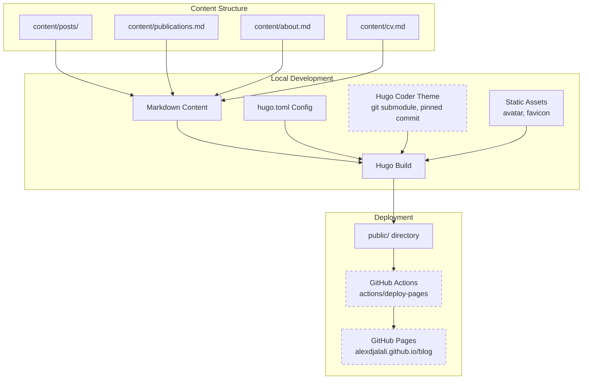

# Personal Blog Implementation Plan

Created: 2026-02-21
Status: VERIFIED
Approved: Yes
Iterations: 0
Worktree: No

> **Status Lifecycle:** PENDING → COMPLETE → VERIFIED
> **Iterations:** Tracks implement→verify cycles (incremented by verify phase)
>
> - PENDING: Initial state, awaiting implementation
> - COMPLETE: All tasks implemented
> - VERIFIED: All checks passed
>
> **Approval Gate:** Implementation CANNOT proceed until `Approved: Yes`
> **Worktree:** Set at plan creation (from dispatcher). `Yes` uses git worktree isolation; `No` works directly on current branch

## Summary

**Goal:** Build a personal blog for Alex Djalali using Hugo with the Hugo Coder theme, inspired by blog.martisak.se's layout patterns (minimal single-column centered layout, circular avatar, nav bar, social links, dark/light mode). Deploy via GitHub Pages with GitHub Actions CI/CD, seeded with real content.

**Architecture:** Hugo static site generator with the Hugo Coder theme installed as a git submodule pinned to a known-good commit. Content authored in Markdown, organized by Hugo's content directory conventions. Taxonomies for tags and categories. GitHub Actions builds and deploys to GitHub Pages on push to main.

**Tech Stack:** Hugo (static site generator, pinned version), Hugo Coder theme (pinned commit), GitHub Pages (hosting), GitHub Actions (CI/CD), Markdown (content), TOML (configuration)

**"Modeled after" scope:** The reference site blog.martisak.se uses a different custom Hugo theme. We are replicating its *layout patterns and navigation structure* — not pixel-perfect reproduction. Specifically: single-column centered layout, circular avatar in masthead, nav bar with similar items, social links in footer, clean minimal typography, dark/light mode. The Publications page, CV page, and search will be adapted to what Hugo Coder supports.

## Architecture Diagram



## Scope

### In Scope

- Initialize git repository and Hugo project structure
- Install Hugo (pinned version) and Hugo Coder theme (pinned commit)
- Customize site identity (title, avatar, bio, social links)
- Set up navigation: Home, Publications, Posts, Categories, Tags, About, CV
- Configure taxonomies (tags, categories)
- Create About page with real bio content (draft for review)
- Create CV page (draft for review)
- Create Publications page as a single curated Markdown page (draft for review)
- Write 1-2 sample blog posts (draft for review)
- Configure dark/light mode toggle
- Set up RSS feed
- Add Creative Commons license in footer
- GitHub Pages deployment with GitHub Actions (official Hugo workflow)
- Create GitHub repository (`alexdjalali/blog`)
- Deploy early (minimal site first, then add content)

### Out of Scope

- Custom theme development (using Hugo Coder as-is with configuration)
- Comment system (can be added later)
- Analytics integration (can be added later)
- Custom domain setup (can be configured later in GitHub Pages settings)
- Multi-language support
- Newsletter/email subscription
- Client-side search (Hugo Coder intentionally does not support it; can add Pagefind later)
- Pixel-perfect replication of blog.martisak.se (different theme)

## Prerequisites

- Homebrew installed (confirmed available at `/opt/homebrew/bin/brew`)
- GitHub CLI authenticated as `alexdjalali` (confirmed)
- Git configured with `Alex Djalali <alex.djalali@gmail.com>` (confirmed)
- Hugo needs to be installed via Homebrew

## Context for Implementer

> This section is critical for cross-session continuity. Write it for an implementer who has never seen the codebase.

- **Patterns to follow:** The blog.martisak.se reference uses a centered single-column layout with circular avatar in the masthead, nav items (Home, Publications, Posts, Categories, Tags, About, CV), social links in footer, and Creative Commons license badge. We replicate the structure and feel, not the exact theme.
- **Conventions:** Hugo Coder theme expects `hugo.toml` for configuration, content in `content/` directory, static assets in `static/`, theme as git submodule in `themes/coder/`. Posts go in `content/posts/`. Hugo Coder uses **language-specific menu format** — menus must be defined under `[[languages.en.menu.main]]`, NOT the generic `[[menu.main]]`.
- **Key files:**
  - `hugo.toml` — Main site configuration (theme, menus, social links, params)
  - `content/about.md` — About page content
  - `content/posts/*.md` — Blog post content
  - `content/publications.md` — Publications as a single curated page
  - `content/cv.md` — CV page
  - `static/images/avatar.jpg` — Profile avatar image
  - `.github/workflows/hugo.yml` — GitHub Actions deployment workflow
- **Gotchas:**
  - Hugo Coder uses Font Awesome icons for social links (fa-brands, fa-solid classes). Recent theme commits changed FA integration — verify icons render after setup.
  - The `info` param accepts a list of strings displayed under the author name on the homepage
  - `colorScheme = "auto"` respects browser preference; toggle is enabled by default with `hideColorSchemeToggle = false`
  - Hugo Coder menus MUST use the language-specific format `[[languages.en.menu.main]]`
  - Theme must be added as git submodule AND pinned to a specific commit SHA
  - Hugo generates RSS at `/index.xml` by default — no additional config needed
  - Only configure `category` and `tag` taxonomies; omit `series` and `author` from the theme's example to avoid empty pages
  - Git clone requires `--recursive` flag to pull the theme submodule
  - All content should start as `draft: true` for Alex to review before publishing
- **Domain context:** Alex Djalali holds a PhD in Linguistics from Stanford, is CTO & Co-Founder of PerceptivePanda (AI micro-interview platform), with background in NLP, computational semantics, and mathematical logic. Previous roles at Salesforce, Tableau, ClearGraph. Academic publications in natural logic and discourse modeling.

## Resolved Decisions

| Decision | Resolution | Rationale |
| -------- | ---------- | --------- |
| GitHub repo name | `alexdjalali/blog` | Project-level Pages avoids conflicts with `alexdjalali.github.io` (profile README repo exists) |
| Base URL | `https://alexdjalali.github.io/blog/` | Trailing slash required for Hugo; matches project-level Pages path |
| Search | Removed from nav | Hugo Coder intentionally doesn't support search; DuckDuckGo won't work until site is indexed; can add Pagefind later |
| Publications format | Single curated Markdown page | Small publication count; avoids need for custom list templates |
| Avatar | Omit `avatarURL` until real photo provided | Hugo Coder gracefully hides avatar when not configured; avoids unprofessional placeholder |
| Content drafts | All content starts as `draft: true` | Alex must review and approve content accuracy before publishing |
| Git email in public commits | Use GitHub noreply email | Prevents email exposure in public repo commit history |
| Deployment approach | Official Hugo GitHub Actions workflow | Uses `actions/configure-pages`, `actions/upload-pages-artifact`, `actions/deploy-pages` per Hugo docs |

## Progress Tracking

**MANDATORY: Update this checklist as tasks complete. Change `[ ]` to `[x]`.**

- [x] Task 1: Initialize git repository and install Hugo
- [x] Task 2: Create Hugo site, install theme, and deploy minimal site
- [x] Task 3: Configure site identity, navigation, and social links
- [x] Task 4: Configure taxonomies
- [x] Task 5: Create About page with bio
- [x] Task 6: Create Publications page
- [x] Task 7: Create CV page
- [x] Task 8: Write sample blog posts
- [x] Task 9: Content review gate and publish

**Total Tasks:** 9 | **Completed:** 9 | **Remaining:** 0

## Implementation Tasks

### Task 1: Initialize git repository and install Hugo

**Objective:** Initialize a git repository in the blog project directory, install Hugo via Homebrew, and configure git for public repo safety.

**Dependencies:** None

**Files:**

- Create: `.gitignore`
- Existing: `docs/` (already created)

**Key Decisions / Notes:**

- Use `git init` in `/Users/adjalali3/Personal/blog/`
- Install Hugo with `brew install hugo` (extended edition, needed for SCSS)
- After install, verify Hugo version and note it for pinning in GitHub Actions
- The `.gitignore` should exclude `public/`, `resources/`, `.hugo_build.lock`, `.DS_Store`
- Configure local git email to GitHub noreply: `git config user.email "alexdjalali@users.noreply.github.com"` to prevent email exposure in public commits
- Do NOT create the Hugo site yet — that's Task 2

**Definition of Done:**

- [ ] Git repository initialized with initial commit containing `docs/` structure and `.gitignore`
- [ ] Hugo installed and `hugo version` reports extended edition
- [ ] `.gitignore` includes `public/`, `resources/`, `.hugo_build.lock`, `.DS_Store`
- [ ] Local repo git email set to GitHub noreply address

**Verify:**

- `git -C /Users/adjalali3/Personal/blog log --oneline` — shows initial commit
- `hugo version` — shows hugo extended version
- `git -C /Users/adjalali3/Personal/blog config user.email` — shows noreply address

### Task 2: Create Hugo site, install theme, and deploy minimal site

**Objective:** Scaffold the Hugo site, add Hugo Coder as a pinned git submodule, configure the GitHub Actions workflow, create the GitHub repo, and deploy a minimal "hello world" site. This validates the entire deployment pipeline early.

**Dependencies:** Task 1

**Files:**

- Create: `hugo.toml` (Hugo scaffolds this, then we configure minimally)
- Create: `themes/coder/` (git submodule)
- Create: `archetypes/default.md` (Hugo scaffolds this)
- Create: `.github/workflows/hugo.yml`
- Create: `content/_index.md` (minimal homepage content)

**Key Decisions / Notes:**

- Run `hugo new site . --force` in the existing blog directory (force because directory isn't empty)
- Add theme as submodule: `git submodule add https://github.com/luizdepra/hugo-coder.git themes/coder`
- **Pin the theme** to a specific commit after verifying the build works: `cd themes/coder && git log --oneline -1` to record the SHA, then commit the `.gitmodules` and theme pointer
- Set minimal `hugo.toml`:
  ```toml
  baseURL = "https://alexdjalali.github.io/blog/"
  title = "Alex Djalali"
  theme = "hugo-coder"
  languageCode = "en"
  defaultContentLanguage = "en"
  ```
- Verify `hugo build` succeeds before proceeding
- Create GitHub repo: `gh repo create alexdjalali/blog --public --source=. --push`
- Configure GitHub Pages source to "GitHub Actions": `gh api repos/alexdjalali/blog/pages -X POST -f build_type=workflow` or via settings
- GitHub Actions workflow uses Hugo's official recommended approach:
  ```yaml
  name: Deploy Hugo site to Pages
  on:
    push:
      branches: [main]
  permissions:
    contents: read
    pages: write
    id-token: write
  concurrency:
    group: "pages"
    cancel-in-progress: false
  jobs:
    build:
      runs-on: ubuntu-latest
      env:
        HUGO_VERSION: <pinned-version>
      steps:
        - uses: actions/checkout@v4
          with:
            submodules: recursive
        - name: Install Hugo CLI
          run: |
            wget -O ${{ runner.temp }}/hugo.deb https://github.com/gohugoio/hugo/releases/download/v${HUGO_VERSION}/hugo_extended_${HUGO_VERSION}_linux-amd64.deb
            sudo dpkg -i ${{ runner.temp }}/hugo.deb
        - name: Build with Hugo
          run: hugo --minify --baseURL "https://alexdjalali.github.io/blog/"
        - name: Upload artifact
          uses: actions/upload-pages-artifact@v3
          with:
            path: ./public
    deploy:
      environment:
        name: github-pages
        url: ${{ steps.deployment.outputs.page_url }}
      runs-on: ubuntu-latest
      needs: build
      steps:
        - name: Deploy to GitHub Pages
          id: deployment
          uses: actions/deploy-pages@v4
  ```
- Pin `HUGO_VERSION` in the workflow to match the locally installed version

**Definition of Done:**

- [ ] Hugo site scaffolded with standard directory structure
- [ ] Hugo Coder theme installed as git submodule at `themes/coder/` and pinned to a specific commit
- [ ] `hugo.toml` has minimal config with correct `baseURL` and `theme`
- [ ] `hugo build` succeeds locally with no errors
- [ ] `.github/workflows/hugo.yml` exists with correct build and deploy steps using pinned Hugo version
- [ ] GitHub repo `alexdjalali/blog` created and source pushed
- [ ] GitHub Pages configured with source "GitHub Actions"
- [ ] GitHub Actions workflow runs successfully
- [ ] Site is accessible at `https://alexdjalali.github.io/blog/`

**Verify:**

- `hugo --source /Users/adjalali3/Personal/blog` — build succeeds
- `gh repo view alexdjalali/blog` — repo exists
- `gh run list --repo alexdjalali/blog --limit 1` — shows successful workflow run
- `curl -s -o /dev/null -w "%{http_code}" https://alexdjalali.github.io/blog/` — returns 200

### Task 3: Configure site identity, navigation, and social links

**Objective:** Populate `hugo.toml` with Alex's identity, full navigation menu, social links, and display preferences.

**Dependencies:** Task 2

**Files:**

- Modify: `hugo.toml`

**Key Decisions / Notes:**

- Full `hugo.toml` configuration with these params:
  ```toml
  [params]
  author = "Alex Djalali"
  description = "Alex Djalali's personal blog"
  keywords = "nlp,ai,linguistics,computational-semantics,blog"
  info = ["NLP · AI · Computational Semantics"]
  dateFormat = "January 2, 2006"
  since = 2026
  colorScheme = "auto"
  hideColorSchemeToggle = false
  license = '<a rel="license" href="http://creativecommons.org/licenses/by-sa/4.0/">CC BY-SA-4.0</a>'
  enableEmoji = true
  ```
- **Avatar:** Do NOT set `avatarURL` — leave it unconfigured until Alex provides a real photo. Hugo Coder gracefully omits the avatar section when not set.
- Navigation menu items using **language-specific format** `[[languages.en.menu.main]]`:
  1. Home (weight 1, url "/")
  2. Publications (weight 2, url "publications/")
  3. Posts (weight 3, url "posts/")
  4. Categories (weight 4, url "categories/")
  5. Tags (weight 5, url "tags/")
  6. About (weight 6, url "about/")
  7. CV (weight 7, url "cv/")
- **No Search nav item** — Hugo Coder doesn't support search; add Pagefind later if desired
- Social links using `[[params.social]]`:
  - GitHub: `fa-brands fa-github fa-2x`, url `https://github.com/alexdjalali/`
  - LinkedIn: `fa-brands fa-linkedin fa-2x`, url placeholder (Alex to fill in)
  - Google Scholar: `fa-brands fa-google-scholar fa-2x`, url placeholder (Alex to fill in)
  - RSS: `fa-solid fa-rss fa-2x`, url `https://alexdjalali.github.io/blog/index.xml`, rel="alternate", type="application/rss+xml"
- Verify all social icons render after configuration (Font Awesome compatibility)
- Set `[languages.en]` with `languageName = "English"`

**Definition of Done:**

- [ ] `hugo.toml` has author, description, keywords, info configured
- [ ] Navigation menu has 7 items using `[[languages.en.menu.main]]` format
- [ ] Social links configured for GitHub, LinkedIn (placeholder), Google Scholar (placeholder), RSS
- [ ] Color scheme set to "auto" with toggle visible
- [ ] Creative Commons license HTML in params
- [ ] `hugo server` shows site with correct title, nav items, and social icons rendering
- [ ] No avatar displayed (intentionally omitted until real photo provided)

**Verify:**

- `hugo server --source /Users/adjalali3/Personal/blog` — site renders with correct title, nav, social icons
- All 7 nav items clickable (pages may 404 until content tasks complete — that's expected)

### Task 4: Configure taxonomies

**Objective:** Set up Hugo taxonomies for tags and categories.

**Dependencies:** Task 2

**Files:**

- Modify: `hugo.toml` (taxonomy configuration)

**Key Decisions / Notes:**

- Configure ONLY two taxonomies in `hugo.toml`:
  ```toml
  [taxonomies]
    category = "categories"
    tag = "tags"
  ```
- Do NOT include `series` or `author` taxonomies from the theme's example config — they would create empty pages
- Hugo automatically generates `/tags/` and `/categories/` list pages using the theme's `terms.html` template
- Taxonomy pages will populate once posts with tags/categories are created in Task 8
- Test with simple single-word tags first; multi-word tags may have known issues with Hugo Coder (theme bug #980)

**Definition of Done:**

- [ ] Taxonomies configured in `hugo.toml` for tags and categories only
- [ ] `/tags/` and `/categories/` pages render without errors (empty until posts exist)
- [ ] No extra taxonomy pages created (no series, no authors)

**Verify:**

- `hugo --source /Users/adjalali3/Personal/blog` — build succeeds with no taxonomy errors
- `hugo server --source /Users/adjalali3/Personal/blog` — `/tags/` and `/categories/` pages render

### Task 5: Create About page with bio

**Objective:** Create a rich About page with Alex Djalali's biography, professional background, and research interests. Content starts as draft for review.

**Dependencies:** Task 3

**Files:**

- Create: `content/about.md`

**Key Decisions / Notes:**

- Front matter:
  ```yaml
  title: "About"
  date: 2026-02-21
  draft: true
  type: "page"
  ```
- Content should include:
  - Professional summary (CTO & Co-Founder of PerceptivePanda)
  - Academic background (Stanford PhD in Linguistics, Fulbright Scholar)
  - Research interests (NLP, computational semantics, natural logic, AI)
  - Career trajectory (Stanford → ClearGraph → Tableau/Salesforce → PerceptivePanda)
  - Link to CV page
- **All biographical content sourced from publicly available information** (PhilPeople, ResearchGate, web search). Alex should review for accuracy before publishing.
- Use `draft: true` — Alex must explicitly approve and flip to `draft: false`

**Definition of Done:**

- [ ] `content/about.md` exists with proper Hugo front matter and `draft: true`
- [ ] Bio covers academic background, research interests, and professional experience
- [ ] Page renders correctly at `/about/` when using `hugo server --buildDrafts`
- [ ] No broken links or formatting issues

**Verify:**

- `hugo server --source /Users/adjalali3/Personal/blog --buildDrafts` — navigate to `/about/` and verify content renders

### Task 6: Create Publications page

**Objective:** Create a Publications page listing Alex Djalali's academic publications as a single curated Markdown page.

**Dependencies:** Task 3

**Files:**

- Create: `content/publications.md`

**Key Decisions / Notes:**

- Use a **single page** approach (not a list/section) since publication count is manageable
- Front matter:
  ```yaml
  title: "Publications"
  date: 2026-02-21
  draft: true
  type: "page"
  ```
- Format each publication entry in Markdown with: authors, title, venue, year, and links (PDF/DOI where available)
- Known publications from public sources:
  - Work with Christopher Potts on natural logic and proof calculus (Stanford)
  - QUD discourse modeling with David Clausen, Sven Lauer, Christopher Potts
- Use `draft: true` — Alex must verify publication list is complete and accurate

**Definition of Done:**

- [ ] `content/publications.md` exists with proper front matter and `draft: true`
- [ ] At least 2 publication entries with title, authors, venue, and year
- [ ] Navigation link to Publications resolves to the page
- [ ] Page uses consistent styling with rest of site

**Verify:**

- `hugo server --source /Users/adjalali3/Personal/blog --buildDrafts` — navigate to `/publications/` and verify content renders

### Task 7: Create CV page

**Objective:** Create a CV page with structured sections for Alex's professional background.

**Dependencies:** Task 3

**Files:**

- Create: `content/cv.md`

**Key Decisions / Notes:**

- Front matter:
  ```yaml
  title: "CV"
  date: 2026-02-21
  draft: true
  type: "page"
  ```
- Sections to include (sourced from public information):
  - **Education:** Stanford PhD in Linguistics (2009-2014), BA + Fulbright
  - **Experience:** PerceptivePanda (CTO & Co-Founder, 2021-present), Salesforce/Tableau, ClearGraph (VP NL Engineering), Nuance Communications, Stanford University
  - **Research Interests:** NLP, AI, computational semantics, natural logic, discourse modeling
  - **Skills:** Python, NLP, AI/ML, software engineering
- Use `draft: true` — Alex must review for accuracy and completeness
- User can later replace this with an external link (like martisak.se → cv.martisak.se) by changing the menu URL

**Definition of Done:**

- [ ] `content/cv.md` exists with proper front matter and `draft: true`
- [ ] Contains structured sections for Education, Experience, Research, Skills
- [ ] Navigation link to CV resolves to the page
- [ ] Content is based on publicly available information

**Verify:**

- `hugo server --source /Users/adjalali3/Personal/blog --buildDrafts` — navigate to `/cv/` and verify content renders

### Task 8: Write sample blog posts

**Objective:** Create 2 sample blog posts with tags and categories to demonstrate the blog's content structure and populate taxonomy pages.

**Dependencies:** Task 4

**Files:**

- Create: `content/posts/hello-world.md`
- Create: `content/posts/on-natural-logic.md`

**Key Decisions / Notes:**

- Post front matter format:
  ```yaml
  title: "Post Title"
  date: 2026-02-21T00:00:00-05:00
  draft: true
  tags: ["tag1", "tag2"]
  categories: ["category"]
  description: "Brief description for SEO"
  ```
- Post 1: "Hello World" — introductory post about the blog, what to expect
  - Tags: `["blog", "personal"]`
  - Categories: `["meta"]`
- Post 2: "On Natural Logic and Computational Semantics" — brief post on Alex's research area
  - Tags: `["nlp", "linguistics", "research"]`
  - Categories: `["research"]`
- Use single-word tags to avoid Hugo Coder multi-word tag bug (#980)
- Both posts 200-400 words, `draft: true`
- After creating posts, verify taxonomy pages populate correctly with `--buildDrafts`

**Definition of Done:**

- [ ] Two posts exist in `content/posts/` with proper front matter and `draft: true`
- [ ] Posts render at `/posts/hello-world/` and `/posts/on-natural-logic/` with `--buildDrafts`
- [ ] Tags and categories from posts appear on `/tags/` and `/categories/` pages
- [ ] Post list page at `/posts/` shows both entries with dates and reading time

**Verify:**

- `hugo server --source /Users/adjalali3/Personal/blog --buildDrafts` — posts render, taxonomy pages populated
- `hugo --source /Users/adjalali3/Personal/blog --buildDrafts` — full build succeeds with no errors

### Task 9: Content review gate and publish

**Objective:** Flip all draft content to published after user review, commit, push, and verify the live deployment.

**Dependencies:** Task 5, Task 6, Task 7, Task 8

**Files:**

- Modify: `content/about.md` (draft: false)
- Modify: `content/publications.md` (draft: false)
- Modify: `content/cv.md` (draft: false)
- Modify: `content/posts/hello-world.md` (draft: false)
- Modify: `content/posts/on-natural-logic.md` (draft: false)

**Key Decisions / Notes:**

- Before flipping drafts: present all content files to Alex for review
- Use `hugo server --buildDrafts` to preview the complete site locally
- After approval, change `draft: true` → `draft: false` in all content files
- Run `hugo` (without `--buildDrafts`) to verify the production build includes all content
- Commit and push to trigger GitHub Actions deployment
- Verify live site has all pages rendering correctly
- **Rollback plan:** If live site is broken, revert the commit with `git revert HEAD` and push, or disable Pages in repo settings via `gh api`

**Definition of Done:**

- [ ] All content files have `draft: false`
- [ ] `hugo` build (without `--buildDrafts`) produces all expected pages
- [ ] Changes pushed to main branch
- [ ] GitHub Actions workflow completes successfully
- [ ] Live site at `https://alexdjalali.github.io/blog/` shows all pages
- [ ] All nav links resolve to valid pages
- [ ] Social icons render correctly
- [ ] Tags and categories pages are populated

**Verify:**

- `hugo --source /Users/adjalali3/Personal/blog` — build succeeds, all pages in `public/`
- `gh run list --repo alexdjalali/blog --limit 1` — latest run successful
- `curl -s -o /dev/null -w "%{http_code}" https://alexdjalali.github.io/blog/` — returns 200
- `curl -s -o /dev/null -w "%{http_code}" https://alexdjalali.github.io/blog/about/` — returns 200
- `curl -s -o /dev/null -w "%{http_code}" https://alexdjalali.github.io/blog/posts/` — returns 200

## Testing Strategy

- **Build verification:** `hugo --source /Users/adjalali3/Personal/blog` succeeds with zero errors/warnings
- **Local preview:** `hugo server --buildDrafts` renders all pages correctly (home, about, cv, publications, posts, tags, categories)
- **Link validation:** All navigation menu items resolve to valid pages
- **Content validation:** Posts display with correct dates, reading times, tags, and categories
- **Social icon verification:** All configured social icons render with correct Font Awesome icons
- **Taxonomy verification:** Tags and categories pages list posts correctly; test with single-word tags
- **Deployment verification:** GitHub Actions builds and deploys without errors; live site is accessible
- **Rollback verification:** Document how to revert (`git revert HEAD && git push`) if deployment breaks

## Risks and Mitigations

| Risk | Likelihood | Impact | Mitigation |
| ---- | ---------- | ------ | ---------- |
| Hugo version incompatibility with theme | Medium | High | Pin Hugo version in both local install verification and GitHub Actions workflow `HUGO_VERSION` env var. Verify build succeeds before proceeding past Task 2. |
| Theme breaking changes on main branch | Medium | High | Pin theme submodule to a specific commit SHA known to build successfully. Never update without testing. |
| Font Awesome social icons not rendering | Medium | Medium | Verify all social icons render after configuring in Task 3. If broken, check theme's FA version and use correct icon class names. |
| Taxonomy template issues with multi-word tags | Medium | Low | Use single-word tags in sample posts. Test taxonomy pages render correctly before publishing. |
| GitHub Pages URL conflicts with existing repos | Low | Medium | Using project-level Pages at `alexdjalali.github.io/blog` avoids conflicts with the existing `alexdjalali` profile repo. |
| Bio/CV content inaccuracy | Medium | Medium | All content starts as `draft: true`. Alex reviews and approves before any content is published (Task 9 gate). |
| Email exposure in public git history | Medium | Low | Configure local git email to GitHub noreply address before any commits. |

## Open Questions

- What should the exact site tagline be? Default: `["NLP · AI · Computational Semantics"]` — Alex can customize in `hugo.toml` `info` param
- LinkedIn profile URL for social links (placeholder until Alex provides)
- Google Scholar profile URL for social links (placeholder until Alex provides)
- Should the CV menu item link to an external hosted CV instead of the internal page? Easy to change later by updating the menu URL in `hugo.toml`

### Deferred Ideas

- Client-side search with Pagefind (lightweight, works offline, no external dependencies)
- Disqus or Giscus comment system integration
- Google Analytics or Plausible analytics
- Custom domain configuration (e.g., blog.alexdjalali.com)
- Newsletter subscription integration
- Academic citation formatting (BibTeX integration)
- Project portfolio page
- Automated link checking in CI (htmltest or htmlproofer)
- Lighthouse CI for accessibility scoring
- Avatar photo upload
- Additional social links (Twitter/X, Mastodon, ORCID)
