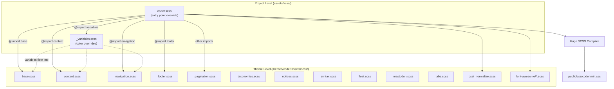

# SCSS Color Override Implementation Plan

Created: 2026-02-22
Status: VERIFIED
Approved: Yes
Iterations: 0
Worktree: No

> **Status Lifecycle:** PENDING → COMPLETE → VERIFIED
> **Iterations:** Tracks implement→verify cycles (incremented by verify phase)

## Summary

**Goal:** Override the Hugo Coder theme's color palette to pure white (`#ffffff`) background with black (`#000000`) foreground and links, creating a clean academic aesthetic matching blog.martisak.se.

**Architecture:** Create project-level SCSS files that Hugo's asset pipeline resolves before the theme's. The project-level `assets/scss/coder.scss` entry point imports a local `_variables.scss` with overridden colors, while all other SCSS partials (base, content, navigation, etc.) fall through to the theme directory.

**Tech Stack:** Hugo SCSS pipeline, Dart Sass (via Hugo), Coder theme (git submodule)

## References

- Story: [5.1-scss-color-overrides](../stories/5.1-scss-color-overrides.md)
- Epic: [epic-05-white-black-academic-theme](../epics/epic-05-white-black-academic-theme.md)
- ADR: [0001-blog-design-white-black-academic-theme](../../adr/0001-blog-design-white-black-academic-theme.md)

## Architecture Diagram

## Scope

### In Scope

- Create `assets/scss/coder.scss` (project-level entry point, identical imports to theme)
- Create `assets/scss/_variables.scss` (all theme variables with overridden colors)
- Light mode color palette: white background, black foreground/links
- Build verification

### Out of Scope

- Dark mode color changes (kept as-is per ADR)
- Layout or template changes (not needed, both sites use same theme)
- Typography changes (system font stack unchanged)
- Adding new CSS/SCSS features

## Prerequisites

- Hugo installed and functional (`hugo` command available)
- Theme submodule present at `themes/coder/`

## Context for Implementer

- **Patterns to follow:** The theme's `_variables.scss` at `themes/coder/assets/scss/_variables.scss` defines all SCSS variables with `!default` flags. The project-level file must declare the SAME variables (without `!default` for overridden ones, with `!default` for unchanged ones — or simply declare all without `!default` since this file completely replaces the theme's).
- **Conventions:** Hugo resolves `resources.Get "scss/coder.scss"` from project `assets/` before theme `assets/`. SCSS `@import` resolves relative to the importing file first, then include paths.
- **Key files:**
  - `themes/coder/assets/scss/coder.scss` — theme entry point to replicate (18 `@import` statements)
  - `themes/coder/assets/scss/_variables.scss` — all variable definitions (fonts, colors, notice colors, font path)
  - `themes/coder/layouts/_partials/head/theme-styles.html` — where Hugo compiles `scss/coder.scss`
  - `hugo.toml` — site config (no changes needed)
- **Gotchas:**
  - The project-level `_variables.scss` **completely replaces** the theme's — it is NOT additive. You must include ALL variables (fonts, colors, notice colors, font path), not just the ones being changed. Missing variables will cause SCSS compilation errors.
  - The `$fa-font-path` variable must be set to `"../fonts"` — this is relative to the compiled CSS output location and points to theme font files.
  - Dark mode variables (`$bg-color-dark`, etc.) are used by `coder-dark.scss`, which has its OWN `@import "variables"`. Since we're NOT overriding `coder-dark.scss` at the project level, the dark mode CSS will still use the theme's `_variables.scss`. This is correct — dark mode stays unchanged.

## Runtime Environment

- **Start command:** `hugo server`
- **Port:** 1313 (default)
- **Health check:** `curl -s http://localhost:1313/ | head -1`
- **Build command:** `hugo --minify`

## Progress Tracking

- [x] Task 1: Create SCSS override files
- [x] Task 2: Build verification

**Total Tasks:** 2 | **Completed:** 2 | **Remaining:** 0

## Implementation Tasks

### Task 1: Create SCSS Override Files

**Objective:** Create the project-level `assets/scss/coder.scss` entry point and `assets/scss/_variables.scss` with the white/black color palette. These two files are the entire implementation surface.

**Dependencies:** None

**Files:**

- Create: `assets/scss/coder.scss`
- Create: `assets/scss/_variables.scss`

**Key Decisions / Notes:**

- `coder.scss` must be an exact copy of `themes/coder/assets/scss/coder.scss` (same 18 `@import` statements in the same order). The only reason we copy it is so that `@import "variables"` resolves to our project-level `_variables.scss`.
- `_variables.scss` must contain ALL variables from the theme's version. The overridden light mode color values are:
  - `$bg-color: #ffffff` (was `#fafafa`)
  - `$fg-color: #000000` (was `#212121`)
  - `$alt-bg-color: #f0f0f0` (was `#e0e0e0`)
  - `$alt-fg-color: #000000` (was `#000`)
  - `$darker-alt-bg-color: #e8e8e8` (was `#ccc`)
  - `$link-color: #000000` (was `#1565c0`)
- All other variables (fonts, dark mode colors, notice colors, font path) remain identical to the theme's values.
- Add a comment at the top of `_variables.scss` referencing ADR-0001.

**Definition of Done:**

- [ ] `assets/scss/coder.scss` exists with identical imports to theme's entry point
- [ ] `assets/scss/_variables.scss` exists with all theme variables and overridden light mode colors
- [ ] `$bg-color` is `#ffffff`, `$fg-color` is `#000000`, `$link-color` is `#000000`
- [ ] All non-color variables (fonts, font path, notice colors, dark mode colors) match theme defaults exactly

**Verify:**

- `diff <(grep '@import' assets/scss/coder.scss) <(grep '@import' themes/coder/assets/scss/coder.scss)` — imports match
- `grep -c 'ffffff' assets/scss/_variables.scss` — contains white background
- `grep -c '000000' assets/scss/_variables.scss` — contains black foreground

### Task 2: Build Verification

**Objective:** Verify that Hugo builds successfully with the new SCSS overrides and that the compiled CSS contains the correct color values.

**Dependencies:** Task 1

**Files:**

- Read: `public/css/coder.min.*.css` (build output, fingerprinted filename)

**Key Decisions / Notes:**

- Run `hugo --minify` and verify exit code 0
- Check the compiled CSS contains `#fff` or `#ffffff` (Hugo/Sass may minify the hex value)
- Check the compiled CSS does NOT contain the old default `#fafafa` (proving the override works)
- The dark mode CSS (`coder-dark.min.*.css`) should be unaffected

**Definition of Done:**

- [ ] `hugo --minify` exits with code 0
- [ ] Compiled light mode CSS contains overridden background color (`#fff` or `#ffffff`)
- [ ] Compiled light mode CSS does NOT contain theme default `#fafafa`
- [ ] Dark mode CSS file is generated (dark mode still works)

**Verify:**

- `hugo --minify` — builds without errors
- `grep -l 'fafafa' public/css/coder.min.*.css` — should return NO matches (old default gone)
- `ls public/css/coder-dark.min.*.css` — dark mode CSS exists

## Testing Strategy

- **Build test:** `hugo --minify` succeeds (automated, verifiable)
- **CSS inspection:** grep compiled CSS for expected/unexpected color values
- **Manual verification:** `hugo server` and visually inspect homepage, post listing, single post, about page (Story 5.2 covers full visual QA)

## Risks and Mitigations

| Risk | Likelihood | Impact | Mitigation |
| ---- | ---------- | ------ | ---------- |
| Missing variable causes SCSS compile error | Medium | High | Copy ALL variables from theme's `_variables.scss`, verify with `hugo --minify` |
| Font Awesome path breaks | Low | Medium | Set `$fa-font-path: "../fonts"` exactly as in theme |
| Hugo version changes SCSS include path resolution | Low | Medium | Pin Hugo version in CI; test after upgrades |

## Open Questions

None — requirements are fully specified in the story and ADR.

### Deferred Ideas

- Consider softening foreground to `#111111` if pure black proves harsh (tracked in Story 5.2 visual QA)
- Add subtle underline to links for better affordance (could be a future story)
