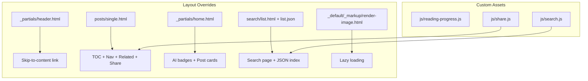

# Standard Blog Features Implementation Plan

Created: 2026-02-22
Status: VERIFIED
Approved: Yes
Iterations: 0
Worktree: No

> **Status Lifecycle:** PENDING → COMPLETE → VERIFIED
> **Iterations:** Tracks implement→verify cycles (incremented by verify phase)

## Summary

**Goal:** Add standard blog features — accessibility shortcuts, performance optimizations, content discoverability tools, and reader engagement features — to the Hugo blog.

**Architecture:** Hugo layout overrides in the project's `layouts/` directory take precedence over the theme's templates. Custom JavaScript and CSS in `assets/` provide interactive features. No theme files are modified.

**Tech Stack:** Hugo templates (Go HTML), vanilla JavaScript, CSS, Hugo's built-in `.TableOfContents` and `.Site.RegularPages.Related`

## References

- Epic: [epic-06-standard-blog-features](../epics/epic-06-standard-blog-features.md)
- ADR: [0002-standard-blog-features](../../adr/0002-standard-blog-features.md)

## Architecture Diagram

## Scope

### In Scope

- Skip-to-content accessibility link
- Lazy image loading via Hugo render hook
- Table of contents on single post pages
- Reading progress indicator (scroll-based)
- Previous/next post navigation
- Related posts (tag/category based)
- Social share buttons (Twitter, LinkedIn, email)
- Client-side search with Hugo JSON index
- AI assistance badge system

### Out of Scope

- Server-side search
- Comment system
- Analytics integration
- Theme modifications

## Prerequisites

- Hugo Coder theme installed as submodule
- SCSS color overrides in place (Epic 5)
- Existing content published

## Context for Implementer

- **Patterns to follow:** Hugo layout override system — project `layouts/` takes precedence over `themes/coder/layouts/`
- **Conventions:** Custom JS files are self-contained IIFEs or `DOMContentLoaded` listeners; no global state; no external dependencies
- **Key files:**
  - `layouts/_partials/header.html` — skip-to-content link added at top
  - `layouts/posts/single.html` — consolidates TOC, reading progress, post nav, related posts, share buttons
  - `layouts/_partials/home.html` — post cards with AI badges
  - `layouts/search/list.html` + `list.json` — search page and JSON index
  - `assets/js/search.js` — client-side search against JSON index
  - `assets/js/reading-progress.js` — scroll-based progress bar
  - `assets/js/share.js` — social share URL generation
- **Gotchas:**
  - Hugo's `.TableOfContents` requires `[markup.tableOfContents]` config in `hugo.toml`
  - Search JSON index uses Hugo's output formats feature (`[outputs] home = ["HTML", "RSS", "JSON"]`)
  - AI badge reads `claude` param from post front matter (not `ai`)

## Runtime Environment

- **Start command:** `hugo server`
- **Port:** 1313
- **Build command:** `hugo --minify`

## Progress Tracking

- [x] Task 1: Accessibility enhancements (skip-to-content, lazy images)
- [x] Task 2: Content discoverability (TOC, post nav, related posts, reading progress)
- [x] Task 3: Client-side search
- [x] Task 4: Reader engagement (share buttons, AI badges, disclaimer page)

**Total Tasks:** 4 | **Completed:** 4 | **Remaining:** 0

## Implementation Tasks

### Task 1: Accessibility Enhancements

**Objective:** Add skip-to-content link and lazy image loading.

**Dependencies:** None

**Files:**

- Create: `layouts/_partials/header.html`
- Create: `layouts/_default/_markup/render-image.html`

**Key Decisions / Notes:**

- Skip-to-content link uses `<a href="#content" class="skip-link">Skip to content</a>` with `sr-only` styling (visible on `:focus`)
- Image render hook adds `loading="lazy"` to all Markdown images automatically
- Both are progressive enhancements — no JS required

**Definition of Done:**

- [x] Skip-to-content link visible on Tab keypress
- [x] All content images rendered with `loading="lazy"`
- [x] `hugo --minify` build succeeds

**Verify:**

- `hugo --minify` — build succeeds
- `grep 'skip' public/index.html` — skip link present

### Task 2: Content Discoverability

**Objective:** Add TOC, post navigation, related posts, and reading progress indicator.

**Dependencies:** None

**Files:**

- Create: `layouts/posts/single.html`
- Create: `assets/js/reading-progress.js`
- Modify: `assets/css/custom.css` (reading progress bar styling)
- Modify: `hugo.toml` (`[markup.tableOfContents]` config)

**Key Decisions / Notes:**

- TOC uses Hugo's built-in `.TableOfContents` with levels 2-3
- Post nav uses `.PrevInSection` / `.NextInSection`
- Related posts use `.Site.RegularPages.Related` limited to 3
- Reading progress calculates `scrollTop / (scrollHeight - clientHeight)` percentage

**Definition of Done:**

- [x] TOC renders on posts with headings
- [x] Previous/next links appear at bottom of posts
- [x] Related posts section shows up to 3 entries
- [x] Reading progress bar tracks scroll position

**Verify:**

- `hugo --minify` — build succeeds

### Task 3: Client-Side Search

**Objective:** Implement search functionality using a Hugo-generated JSON index.

**Dependencies:** None

**Files:**

- Create: `content/search/_index.md`
- Create: `layouts/search/list.html`
- Create: `layouts/search/list.json`
- Create: `assets/js/search.js`
- Modify: `hugo.toml` (output formats)

**Key Decisions / Notes:**

- Hugo generates a JSON index at `/search/index.json` containing title, content, tags, and permalink for each page
- JS performs case-insensitive substring matching against the index
- No external search dependencies (Pagefind, Lunr, Algolia)

**Definition of Done:**

- [x] `/search/` page renders with input field
- [x] Search returns results for known titles
- [x] JSON index generated at build time

**Verify:**

- `hugo --minify` — build succeeds
- `ls public/search/index.json` — JSON index exists

### Task 4: Reader Engagement

**Objective:** Add share buttons and AI assistance badges.

**Dependencies:** None

**Files:**

- Create: `assets/js/share.js`
- Modify: `layouts/posts/single.html` (share buttons section)
- Create: `layouts/_partials/home.html` (AI badge in post cards)
- Create: `content/ai-disclaimer.md`

**Key Decisions / Notes:**

- Share buttons generate URLs for Twitter (`intent/tweet`), LinkedIn (`shareArticle`), and email (`mailto:`)
- AI badge reads `claude` front matter param: `true` = AI-assisted, `false` = not
- AI Disclaimer page explains the badge system

**Definition of Done:**

- [x] Share buttons render on post pages
- [x] AI badges appear on homepage post cards
- [x] AI Disclaimer page accessible at `/ai-disclaimer/`

**Verify:**

- `hugo --minify` — build succeeds
- `grep 'claude-badge' public/index.html` — AI badges present

## Testing Strategy

- **Build test:** `hugo --minify` succeeds with no errors
- **HTML inspection:** grep rendered HTML for expected elements (skip-link, lazy loading, badges)
- **Manual verification:** `hugo server` and test each feature in browser

## Risks and Mitigations

| Risk | Likelihood | Impact | Mitigation |
| ---- | ---------- | ------ | ---------- |
| Layout overrides diverge from theme updates | Medium | Medium | Pin theme submodule; reconcile on upgrade |
| Search index size grows | Low | Low | Personal blog scale; JSON is small |
| Share URLs break if platforms change endpoints | Low | Low | Standard share URLs; easy to update |

## Open Questions

None — all features are implemented and verified.

### Deferred Ideas

- Pagefind for higher-quality search
- Giscus comment system
- Webmentions support
