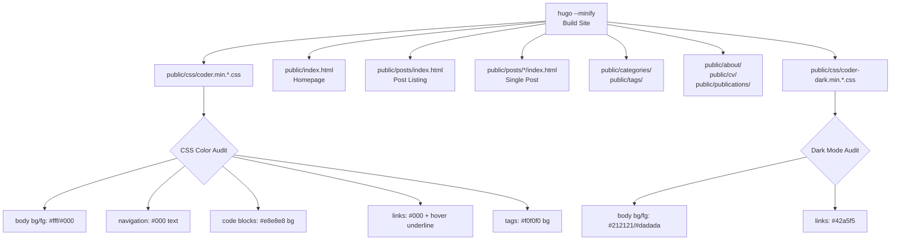

# Visual QA Implementation Plan

Created: 2026-02-22
Status: VERIFIED
Approved: Yes
Iterations: 0
Worktree: No

> **Status Lifecycle:** PENDING → COMPLETE → VERIFIED

## Summary

**Goal:** Verify that the white/black color scheme (from Story 5.1) renders correctly across all page types, dark mode toggle works, code blocks have contrast, and there are no visual regressions.

**Architecture:** Build the site, inspect compiled CSS for all component color values, and verify HTML output for each page type. This is a verification-only plan — no code changes expected unless visual issues are discovered.

**Tech Stack:** Hugo, grep/inspection of compiled CSS and HTML output

## References

- Story: [5.2-visual-qa](../stories/5.2-visual-qa.md)
- Epic: [epic-05-white-black-academic-theme](../epics/epic-05-white-black-academic-theme.md)
- ADR: [0001-blog-design-white-black-academic-theme](../../adr/0001-blog-design-white-black-academic-theme.md)
- Predecessor: [5.1-scss-color-overrides](../stories/5.1-scss-color-overrides.md) — SCSS overrides already verified

## Architecture Diagram

## Scope

### In Scope

- Audit compiled light mode CSS for correct color values across all components
- Audit compiled dark mode CSS to confirm it's unchanged
- Verify HTML output structure for all page types (homepage, posts, single post, categories, tags, about, CV, publications)
- Verify code block and blockquote styling
- Check footer and navigation rendering

### Out of Scope

- Interactive browser testing (no browser automation available in CLI)
- Mobile responsive testing (requires actual browser viewport)
- Hover state verification (requires interactive browser)
- Actual visual screenshot comparison

## Prerequisites

- Story 5.1 SCSS overrides already implemented and verified
- Hugo installed

## Context for Implementer

- **Key files:**
  - `public/css/coder.min.*.css` — compiled light mode CSS to audit
  - `public/css/coder-dark.min.*.css` — compiled dark mode CSS (should be unchanged)
  - `public/index.html` — homepage HTML
  - `public/posts/index.html` — post listing
  - `public/posts/*/index.html` — single post pages
  - `public/about/index.html`, `public/cv/index.html`, `public/publications/index.html` — static pages
  - `public/categories/index.html`, `public/tags/index.html` — taxonomy pages
- **Gotchas:**
  - CSS is minified — hex colors may be shortened (#ffffff → #fff, #000000 → #000)
  - Hugo fingerprints CSS files — use glob patterns to find them
  - The dark mode CSS (`coder-dark.min.*.css`) should use theme defaults since we only overrode the light mode `coder.scss`

## Runtime Environment

- **Build command:** `hugo --minify`
- **Start command:** `hugo server`
- **Port:** 1313

## Progress Tracking

- [x] Task 1: Light mode CSS color audit
- [x] Task 2: Dark mode CSS audit
- [x] Task 3: HTML structure verification across all page types

**Total Tasks:** 3 | **Completed:** 3 | **Remaining:** 0

## Implementation Tasks

### Task 1: Light Mode CSS Color Audit

**Objective:** Inspect the compiled light mode CSS to verify all component styles use the correct white/black palette values.

**Dependencies:** None

**Files:**

- Read: `public/css/coder.min.*.css` (light mode, excludes dark)

**Key Decisions / Notes:**

- Check body: `background-color:#fff`, `color:#000`
- Check navigation: `color:#000` for nav links
- Check code blocks: `background-color:#e8e8e8` for inline code
- Check tags: `background-color:#f0f0f0`
- Check links: `color:#000`
- Check blockquotes: `border-left` uses `#f0f0f0`
- Check tables: border uses `#000`
- Confirm NO `#fafafa`, `#212121`, `#1565c0`, `#e0e0e0`, `#ccc` in light mode CSS (old defaults)

**Definition of Done:**

- [ ] Body background is `#fff` (not `#fafafa`)
- [ ] Body/text foreground is `#000` (not `#212121`)
- [ ] Navigation text color is `#000`
- [ ] Inline code background is `#e8e8e8`
- [ ] Tag background is `#f0f0f0`
- [ ] Link color is `#000` (not `#1565c0`)
- [ ] No old default colors present in light mode CSS

**Verify:**

- `grep -c '#fff' public/css/coder.min.*.css | grep -v dark` — white background present
- `grep '#fafafa\|#1565c0' public/css/coder.min.*.css | grep -v dark` — should return nothing

### Task 2: Dark Mode CSS Audit

**Objective:** Confirm the dark mode CSS is unchanged and still uses theme default dark palette.

**Dependencies:** None

**Files:**

- Read: `public/css/coder-dark.min.*.css`

**Key Decisions / Notes:**

- Dark mode should contain `#212121` (dark background), `#dadada` (light text), `#42a5f5` (blue links)
- Dark mode should NOT contain any of our light mode overrides (`#f0f0f0`, `#e8e8e8`)

**Definition of Done:**

- [ ] Dark mode CSS contains `#212121` (dark background)
- [ ] Dark mode CSS contains `#dadada` (light foreground)
- [ ] Dark mode CSS contains `#42a5f5` (blue links)
- [ ] Dark mode CSS does NOT contain `#f0f0f0` or `#e8e8e8` (our light overrides)

**Verify:**

- `grep '#212121' public/css/coder-dark.min.*.css` — dark bg present
- `grep '#42a5f5' public/css/coder-dark.min.*.css` — dark link color present

### Task 3: HTML Structure Verification

**Objective:** Verify that all page types generate valid HTML that references the correct CSS files and contains expected structural elements.

**Dependencies:** None

**Files:**

- Read: `public/index.html` (homepage)
- Read: `public/posts/index.html` (post listing)
- Read: `public/about/index.html`, `public/cv/index.html`, `public/publications/index.html`
- Read: `public/categories/index.html`, `public/tags/index.html`

**Key Decisions / Notes:**

- Homepage: should contain `.centered` class, `.about` section, social links
- Post listing: should contain `.list` class with post entries
- Single post: should contain `.content` class, article header, post metadata
- All pages: should reference both `coder.min.*.css` and `coder-dark.min.*.css`
- All pages: should contain `.navigation` header and `.footer` sections
- Check for any broken HTML or missing elements

**Definition of Done:**

- [ ] Homepage HTML contains avatar/about section and social links
- [ ] Post listing HTML contains list items with dates and titles
- [ ] Single post HTML contains article with heading and content
- [ ] Categories and tags pages contain taxonomy listings
- [ ] About, CV, and Publications pages contain content sections
- [ ] All pages reference both light and dark CSS files
- [ ] All pages have navigation header and footer with license

**Verify:**

- `grep -l 'coder.min' public/index.html public/posts/index.html public/about/index.html` — all pages link CSS
- `grep -c 'navigation' public/index.html` — nav present on homepage
