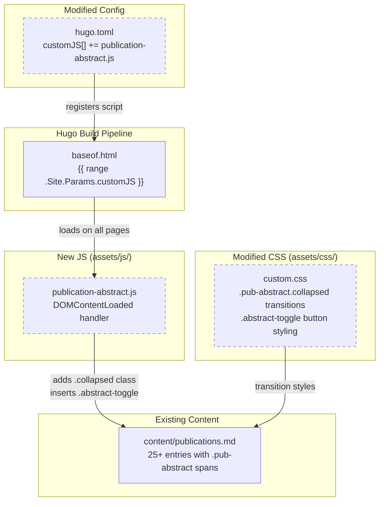

# Publication Abstract Toggle Implementation Plan

Created: 2026-02-23
Status: VERIFIED
Approved: Yes
Iterations: 0
Worktree: No

> **Status Lifecycle:** PENDING → COMPLETE → VERIFIED
> **Iterations:** Tracks implement→verify cycles (incremented by verify phase)
>
> - PENDING: Initial state, awaiting implementation
> - COMPLETE: All tasks implemented
> - VERIFIED: All checks passed
>
> **Approval Gate:** Implementation CANNOT proceed until `Approved: Yes`
> **Worktree:** Set at plan creation (from dispatcher). `Yes` uses git worktree isolation; `No` works directly on current branch

## Summary

**Goal:** Add per-entry "Abstract" / "Hide abstract" toggle buttons to the publications page so that inline abstracts are collapsed by default, making the page scannable while keeping abstracts accessible on demand.

**Architecture:** A small vanilla JS file (`publication-abstract.js`) runs on `DOMContentLoaded`, queries all existing `.pub-abstract` spans, adds a `collapsed` class to hide them, and injects an `.abstract-toggle` button after each citation's BibTeX link. CSS collapse/expand transitions are modeled on the CV page's `.description.collapsed` pattern. The JS file is loaded globally via Hugo's `customJS` param in `hugo.toml`.

**Tech Stack:** Vanilla JavaScript, CSS transitions, Hugo `customJS` pipeline

## References

- ADR: [0004-publication-abstract-toggle](../../adr/0004-publication-abstract-toggle.md)

## Architecture Diagram

## Scope

### In Scope

- Create `assets/js/publication-abstract.js` with toggle behavior
- Add `.pub-abstract.collapsed` and `.abstract-toggle` CSS to `assets/css/custom.css`
- Register the new JS file in `hugo.toml` `customJS` array
- Dark mode support for the toggle button
- Print media rule: abstracts visible, buttons hidden
- Progressive enhancement: no-JS shows abstracts (current behavior)

### Out of Scope

- Changes to `content/publications.md` content or structure
- Global "show/hide all" toggle (deferred)
- Any changes to the CV page's "Learn More" implementation
- Layout template changes (the existing `publications/single.html` is sufficient)

## Prerequisites

- Existing `.pub-abstract` spans in `content/publications.md` (confirmed: 25+ entries)
- Hugo `customJS` pipeline functional (confirmed: `baseof.html:49-57`)
- Existing `.pub-abstract` base styles in `custom.css:323-345`

## Context for Implementer

> This section is critical for cross-session continuity. Write it for an implementer who has never seen the codebase.

- **Patterns to follow:**
  - **JS toggle pattern:** `assets/js/cv-timeline.js:290-301` — the "Learn More" button creates an `<a>` element, attaches a click handler that toggles `.collapsed` class on a sibling element, and swaps button text between "Learn more" / "Show less"
  - **CSS collapse pattern:** `assets/css/cv-timeline.css:223-237` — uses `max-height: 0` + `overflow: hidden` + `opacity: 0` for collapsed state, and `max-height: 500px` + `opacity: 1` for expanded, with `ease` transitions
  - **Button styling:** `assets/css/cv-timeline.css:239-280` — `.learn-more` class uses `font-size: 0.58em`, `border: 1px solid #ccc`, `border-radius: 3px`, `padding: 0.12em 0.55em`, `background: #fafafa`, with hover state changing color to `#c0392b`
  - **Print override:** `assets/css/cv-timeline.css:501-511` — `.collapsed` gets `max-height: none; overflow: visible; opacity: 1`, and `.learn-more` gets `display: none !important`

- **Conventions:**
  - Custom JS files are self-contained scripts loaded via `hugo.toml` `customJS` array
  - Each JS file wraps logic in a `DOMContentLoaded` listener or IIFE
  - CSS additions go in `assets/css/custom.css` in logical sections with comments
  - Dark mode: `body.colorscheme-dark` selector + `@media (prefers-color-scheme: dark)` for `body.colorscheme-auto`

- **Key files:**
  - `content/publications.md` — 25+ publication entries, each `<li>` contains a `` at the end, and most have a `<a class="bib-link">BibTeX</a>` link before the abstract span
  - `assets/css/custom.css:323-345` — existing `.pub-abstract` base styles (display, font-size, color, border-left). New collapsed/toggle styles go immediately after this block
  - `hugo.toml:54` — `customJS` array where the new script must be registered
  - `layouts/baseof.html:49-57` — the loop that loads `customJS` entries via Hugo's asset pipeline (minify + fingerprint in production, raw in dev)

- **Gotchas:**
  - The `.pub-abstract` spans are inside `<li>` elements within `<ul class="cv-list">` — the parent `<li>` is the entry container
  - Not every entry has a `.bib-link` — e.g., some entries have no downloadable BibTeX. The toggle button should be inserted after the `.bib-link` if present, otherwise appended before the `.pub-abstract` span
  - The `customJS` entries use relative paths from `assets/` (e.g., `"js/publication-abstract.js"` not `"assets/js/publication-abstract.js"`)
  - The script loads on ALL pages (not just publications), so the JS must guard against pages with no `.pub-abstract` elements — `querySelectorAll` returning empty is sufficient (no-op loop)
  - The existing `.pub-abstract` has `display: block` — the collapsed state must override this

- **Domain context:** The publications page lists academic journal articles, conference papers, a dissertation, and patents. Each entry has a citation line followed by an abstract. The page is long (~100+ lines of abstracts) and the toggle makes it scannable.

## Runtime Environment

- **Start command:** `hugo server`
- **Port:** 1313
- **Build command:** `hugo --minify`
- **Health check:** Navigate to `http://localhost:1313/blog/publications/`

## Progress Tracking

**MANDATORY: Update this checklist as tasks complete. Change `[ ]` to `[x]`.**

- [x] Task 1: Add collapse/expand CSS and toggle button styling
- [x] Task 2: Create publication-abstract.js and register in hugo.toml

**Total Tasks:** 2 | **Completed:** 2 | **Remaining:** 0

## Implementation Tasks

### Task 1: Add Collapse/Expand CSS and Toggle Button Styling

**Objective:** Add CSS rules for `.pub-abstract.collapsed` (hidden state with transitions), `.pub-abstract:not(.collapsed)` (visible state with transitions), `.abstract-toggle` button styling (matching `.learn-more`), dark mode variants, and print media override.

**Dependencies:** None

**Files:**

- Modify: `assets/css/custom.css` (add rules after the existing `.pub-abstract` block at line 345)

**Key Decisions / Notes:**

- Place new CSS immediately after the existing `@media (prefers-color-scheme: dark) { body.colorscheme-auto .cv-list .pub-abstract { ... } }` block at line 345
- Collapse transition: `max-height: 0; overflow: hidden; opacity: 0; margin: 0; padding: 0; border-left-width: 0` with `transition: max-height 0.35s ease, opacity 0.25s ease, margin 0.3s ease, border-left-width 0.2s ease`
- Expand transition: `max-height: 600px; opacity: 1` with `transition: max-height 0.4s ease, opacity 0.3s ease 0.1s`
- The existing `.pub-abstract` has `margin: 0.35em 0 0.4em 0` and `padding-left: 0.5em` and `border-left: 2px solid #ddd` — the collapsed state must zero these out for a clean collapse
- `.abstract-toggle` styling: clone `.learn-more` styles exactly (same font-size, color, border, padding, hover effect)
- Dark mode: same overrides as `.learn-more` dark mode (`color: #aaa`, `border-color: #555`, `background: #2a2a2a`)
- Print: `.pub-abstract.collapsed` → `max-height: none; overflow: visible; opacity: 1; margin/padding/border restored`; `.abstract-toggle` → `display: none !important`

**Definition of Done:**

- [ ] `.pub-abstract.collapsed` hides the abstract with `max-height: 0; overflow: hidden; opacity: 0`
- [ ] `.pub-abstract:not(.collapsed)` expands with `max-height: 600px; opacity: 1` and smooth transitions
- [ ] `.abstract-toggle` styled identically to `.learn-more` (border, font-size, colors, hover state)
- [ ] Dark mode overrides for `.abstract-toggle` match `.learn-more` dark mode styles
- [ ] Auto dark mode (`@media prefers-color-scheme: dark`) overrides for both `.pub-abstract.collapsed` and `.abstract-toggle`
- [ ] Print media: `.pub-abstract.collapsed` shows full content; `.abstract-toggle` hidden
- [ ] `hugo --minify` build succeeds

**Verify:**

- `hugo --minify` — build succeeds with no SCSS/CSS errors
- `grep 'pub-abstract.collapsed' assets/css/custom.css` — collapsed rule exists
- `grep 'abstract-toggle' assets/css/custom.css` — toggle button styles exist

### Task 2: Create publication-abstract.js and Register in hugo.toml

**Objective:** Create the JavaScript file that collapses all `.pub-abstract` elements on page load and injects per-entry "Abstract" toggle buttons. Register it in `hugo.toml` `customJS`.

**Dependencies:** Task 1

**Files:**

- Create: `assets/js/publication-abstract.js`
- Modify: `hugo.toml` (add `"js/publication-abstract.js"` to `customJS` array)

**Key Decisions / Notes:**

- Wrap in `document.addEventListener("DOMContentLoaded", function () { ... })` — same pattern as other custom JS files
- Query `document.querySelectorAll(".pub-abstract")` — if empty, the script is a no-op (safe for non-publications pages)
- For each `.pub-abstract` element:
  1. Add `collapsed` class to hide it
  2. Create an `<a>` element with class `abstract-toggle`, text "Abstract", `href="#"`
  3. Insert the toggle button before the `.pub-abstract` span (using `parentNode.insertBefore(toggle, abstractSpan)`)
  4. Attach click handler: `event.preventDefault()`, toggle `collapsed` class on the abstract span, swap text between "Abstract" / "Hide abstract"
- Follow the exact pattern from `cv-timeline.js:290-301` for the click handler
- Insert the toggle BEFORE the abstract span (not after the bib-link) — this is simpler and more robust since every entry has an abstract but not every entry has a bib-link
- Add the script to `hugo.toml` `customJS` array at line 54

**Definition of Done:**

- [ ] `assets/js/publication-abstract.js` exists with `DOMContentLoaded` handler
- [ ] All `.pub-abstract` elements receive `collapsed` class on page load
- [ ] An "Abstract" toggle button is inserted before each `.pub-abstract` span
- [ ] Clicking "Abstract" expands the abstract (removes `collapsed` class) and changes text to "Hide abstract"
- [ ] Clicking "Hide abstract" collapses the abstract and changes text back to "Abstract"
- [ ] Script is registered in `hugo.toml` `customJS` array
- [ ] `hugo --minify` build succeeds
- [ ] Publications page at `/publications/` loads with all abstracts collapsed
- [ ] Non-publications pages (e.g., homepage) load without JS errors

**Verify:**

- `hugo --minify` — build succeeds
- `grep 'publication-abstract' hugo.toml` — script registered in customJS
- `hugo server` — navigate to `/publications/`, confirm abstracts are collapsed with "Abstract" buttons visible

## Testing Strategy

- **Build test:** `hugo --minify` succeeds with no errors
- **Manual verification:**
  1. `hugo server` → navigate to `http://localhost:1313/blog/publications/`
  2. All abstracts collapsed on load (only citation text visible)
  3. Click "Abstract" on any entry → abstract expands smoothly
  4. Button text changes to "Hide abstract"
  5. Click "Hide abstract" → abstract collapses smoothly
  6. Test on multiple entries to confirm independent toggle
  7. Test dark mode: toggle button colors adapt correctly
  8. Test homepage and other pages: no JS errors in console
- **Progressive enhancement:** Disable JS (or view source) — `.pub-abstract` spans have no `collapsed` class in the static HTML, so abstracts show by default
- **Print:** Browser print preview should show all abstracts expanded and no toggle buttons

## Risks and Mitigations

| Risk | Likelihood | Impact | Mitigation |
| ---- | ---------- | ------ | ---------- |
| `max-height: 600px` clips very long abstracts | Low | Low | Longest current abstract is ~5 lines (~120px); 600px provides 5x headroom |
| Script runs on all pages (not just publications) | N/A | None | `querySelectorAll(".pub-abstract")` returns empty on non-publication pages — loop is a no-op |
| Future publications without `.pub-abstract` class | Low | Low | Author-controlled Markdown; class is part of the established content pattern |

## Open Questions

None — requirements are fully specified in the ADR.

### Deferred Ideas

- Global "Show all / Hide all abstracts" toggle at the top of the page
- URL hash-based deep linking to a specific publication with its abstract pre-expanded
- Keyboard shortcut to expand/collapse all
