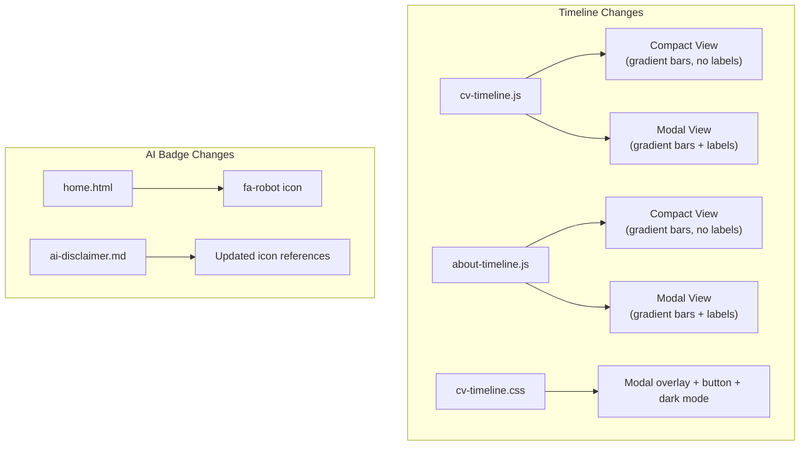

# Timeline and UI Refinements Implementation Plan

Created: 2026-02-23
Status: VERIFIED
Approved: Yes
Iterations: 0
Worktree: No

> **Status Lifecycle:** PENDING → COMPLETE → VERIFIED
> **Iterations:** Tracks implement→verify cycles (incremented by verify phase)

## Summary

**Goal:** Refine the D3.js timeline components with modal expansion and color gradient, and update the AI badge icon to a neutral robot.

**Architecture:** Modify existing JavaScript files (`cv-timeline.js`, `about-timeline.js`) to add modal view and color gradient. Update CSS (`cv-timeline.css`) with modal overlay styles. Update HTML template and content for AI badge icon change.

**Tech Stack:** D3.js, vanilla JavaScript, CSS, Hugo templates

## References

- Epic: [epic-07-timeline-and-ui-refinements](../epics/epic-07-timeline-and-ui-refinements.md)
- ADR: [0003-timeline-components-and-ui-refinements](../../adr/0003-timeline-components-and-ui-refinements.md)

## Architecture Diagram

## Scope

### In Scope

- Add `openModal()` function to both timeline JS files
- Replace binary job/education coloring with sequential gradient via `getColorScale()`
- Add expand button and modal overlay CSS
- Remove inline bar labels, legend from compact view
- Update AI badge icon from thumbs to robot

### Out of Scope

- Timeline data changes
- New timeline features (zoom, pan, filtering)
- Other layout or content changes

## Prerequisites

- D3.js available (loaded from CDN in page templates)
- Existing timeline components functional

## Context for Implementer

- **Patterns to follow:** Both timeline files follow the same IIFE pattern with `draw()`, `resize()`, tooltip helpers, and intersection observer for lazy initialization
- **Conventions:** D3.js selections use method chaining; CSS uses BEM-lite naming; dark mode support via `body.colorscheme-dark` class and `prefers-color-scheme` media query
- **Key files:**
  - `assets/js/cv-timeline.js` — CV page timeline (also has `buildSection()` for detail entries)
  - `assets/js/about-timeline.js` — About page timeline (simpler, no detail sections)
  - `assets/css/cv-timeline.css` — Shared timeline styles (used by both pages)
  - `layouts/_partials/home.html` — Post card template with AI badge
  - `content/ai-disclaimer.md` — AI badge documentation
- **Gotchas:**
  - Modal z-index must exceed tooltip z-index (modal: 10000, tooltip: 10001)
  - Color gradient uses `d3.interpolateHsl()` — requires D3 color module
  - Modal creates its own tooltip (separate from compact view tooltip) and cleans up on close
  - Both compact `resize()` and modal must call `assignLanes()` independently

## Progress Tracking

- [x] Task 1: Timeline modal expansion
- [x] Task 2: Sequential color gradient
- [x] Task 3: AI badge icon update

**Total Tasks:** 3 | **Completed:** 3 | **Remaining:** 0

## Implementation Tasks

### Task 1: Timeline Modal Expansion

**Objective:** Add an "Expand Timeline" button and full-viewport modal to both timeline components.

**Dependencies:** None

**Files:**

- Modify: `assets/js/cv-timeline.js` (add `addExpandButton()`, `openModal()`)
- Modify: `assets/js/about-timeline.js` (add `addExpandButton()`, `openModal()`)
- Modify: `assets/css/cv-timeline.css` (add modal overlay, button, close button styles)

**Key Decisions / Notes:**

- Modal uses `MODAL_LANE_HEIGHT = 36` (vs compact `LANE_HEIGHT = 28`) for better label readability
- Modal renders its own SVG with independent scale, not a copy of the compact SVG
- Modal creates its own tooltip element and removes it on close
- Close handlers: Escape key (`document.addEventListener`), backdrop click, close button
- CV timeline modal bars have `click` handler that calls `closeModal()` then `scrollToEntry(d)`
- Remove inline bar labels from `draw()` and `resize()` — replaced by expand button

**Definition of Done:**

- [x] Expand button appears below both timelines
- [x] Modal opens with full-width SVG and labeled bars
- [x] Modal closes via all three methods
- [x] No memory leaks (event listeners cleaned up on close)

**Verify:**

- `hugo --minify` — build succeeds
- Manual test: expand button visible, modal opens/closes

### Task 2: Sequential Color Gradient

**Objective:** Replace binary job/education coloring with a sequential HSL gradient.

**Dependencies:** None

**Files:**

- Modify: `assets/js/cv-timeline.js` (add `isDarkMode()`, `getColorScale()`, apply to bars)
- Modify: `assets/js/about-timeline.js` (already has `getColorScale()`, update colors)
- Modify: `assets/css/cv-timeline.css` (remove `.bar-rect.job`, `.bar-rect.education`, legend classes)

**Key Decisions / Notes:**

- `getColorScale()` returns `d3.scaleSequential().interpolator(d3.interpolateHsl(start, end))`
- Light mode: `#f4a5a5` → `#7b1a1a` (soft red to dark maroon)
- Dark mode: `#ef9a9a` → `#c0392b` (light red to medium red)
- Color applied via `.style("fill", function(d, i) { return colorScale(i); })` instead of CSS class
- Removed CSS: `.bar-rect.job`, `.bar-rect.education`, `.timeline-legend`, `.legend-swatch`
- Removed dark mode / auto mode overrides for removed classes

**Definition of Done:**

- [x] Bars use gradient coloring (each bar has unique color)
- [x] Dark mode uses lighter gradient
- [x] Legend removed from compact view
- [x] No CSS references to removed classes

**Verify:**

- `hugo --minify` — build succeeds
- Manual test: bars show gradient in both light and dark mode

### Task 3: AI Badge Icon Update

**Objective:** Change AI badge from thumbs-up/down to neutral robot icon.

**Dependencies:** None

**Files:**

- Modify: `layouts/_partials/home.html` (`fa-thumbs-up` → `fa-robot`, `fa-thumbs-down` → `fa-robot`)
- Modify: `content/ai-disclaimer.md` (update icon references and descriptions)

**Key Decisions / Notes:**

- AI-assisted: `<i class="fa-solid fa-robot" style="color: #2980b9;"></i>`
- Non-AI-assisted: `<i class="fa-solid fa-robot" style="color: #bbb;"></i>`
- Same change applied in both the Hugo template and the Markdown content page

**Definition of Done:**

- [x] Homepage shows robot icon (not thumbs)
- [x] AI Disclaimer page references robot icon
- [x] Colors match: blue for AI-assisted, gray for non-AI-assisted

**Verify:**

- `hugo --minify` — build succeeds
- `grep 'fa-robot' public/index.html` — robot icon present
- `grep 'fa-thumbs' public/index.html` — no thumbs icons

## Testing Strategy

- **Build test:** `hugo --minify` succeeds
- **CSS inspection:** Verify removed classes not in output CSS
- **HTML inspection:** Verify icon classes in rendered HTML
- **Manual verification:** `hugo server` and test modal, colors, and badges

## Risks and Mitigations

| Risk | Likelihood | Impact | Mitigation |
| ---- | ---------- | ------ | ---------- |
| Modal z-index conflicts | Low | Medium | z-index 10000+ tested across all pages |
| D3 color interpolation fails | Low | High | `d3.interpolateHsl` is core D3; well-tested |
| Gradient colors poor in certain color-blind modes | Medium | Low | Tooltips and modal labels provide text identification |

## Open Questions

None — all changes are implemented and verified.

### Deferred Ideas

- Zoomable timeline (d3-zoom)
- Timeline filtering by type (job/education toggle)
- Animated transitions between compact and modal views
