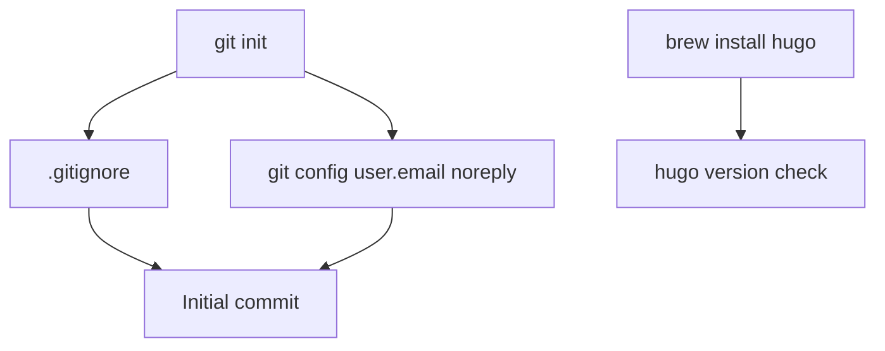

[Back to Spec](../epics/epic-01-project-foundation.md)

# Story 1.1 — Initialize Git Repository and Install Hugo

**Epic**: 1 — Project Foundation & Deployment Pipeline **Points**: 2 **Status**: Complete

---

## Story

**As a** blog developer, **I want** a git repository initialized with proper `.gitignore` and privacy settings, and Hugo installed locally, **So that** I have the foundational tooling to build and version-control the blog.

**Acceptance Criteria**:

- Git repository initialized in `/Users/adjalali3/Personal/blog/`
- `.gitignore` excludes `public/`, `resources/`, `.hugo_build.lock`, `.DS_Store`, `.hugo_build.lock`
- Local git email configured to `alexdjalali@users.noreply.github.com` (prevents email exposure in public commits)
- Hugo extended edition installed via `brew install hugo`
- Hugo version noted for pinning in GitHub Actions workflow (Story 1.3)
- Initial commit includes `docs/` structure and `.gitignore`

**Testing**: Manual verification:

- `git log --oneline` shows initial commit
- `hugo version` reports extended edition
- `git config user.email` shows noreply address
- `.gitignore` contains expected exclusions

---

## Architecture References

- [Implementation Plan](../plans/2026-02-21-personal-blog.md) — Task 1

---

## Architecture Diagram

---

## Checklist

### Coding Patterns (apply where appropriate)

- [ ] **DRY** — no duplicated logic; extract shared utilities

### Testing Requirements

- [ ] Manual verification of git status, Hugo version, email config

### Documentation Requirements

- [ ] `.gitignore` documents excluded patterns
- [ ] Hugo version recorded for CI pinning

### Completion Workflow

- [ ] All checklist items above are satisfied
- [ ] Run project quality gates (format, lint, type check, tests)
- [ ] All quality gates pass
- [ ] Commit with conventional commit message
- [ ] Update story status from "Todo" to "Complete" (handled by /spec-verify)
