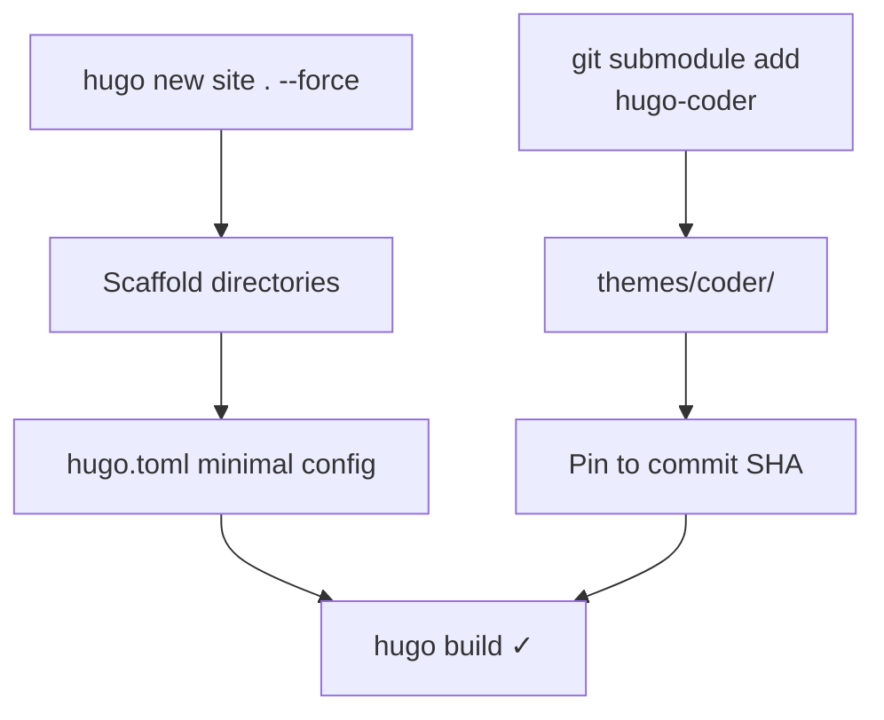

[Back to Spec](../epics/epic-01-project-foundation.md)

# Story 1.2 — Scaffold Hugo Site and Install Theme

**Epic**: 1 — Project Foundation & Deployment Pipeline **Points**: 3 **Status**: Todo

---

## Story

**As a** blog developer, **I want** the Hugo site scaffolded and the Hugo Coder theme installed as a pinned git submodule, **So that** I have a working site skeleton that builds locally without errors.

**Acceptance Criteria**:

- Hugo site scaffolded with `hugo new site . --force` (force because directory already has `docs/`)
- Hugo Coder theme added as git submodule at `themes/coder/`
- Theme pinned to a specific commit SHA (record the SHA, do not track `HEAD` of `main`)
- Minimal `hugo.toml` configured:
  ```toml
  baseURL = "https://alexdjalali.github.io/blog/"
  title = "Alex Djalali"
  theme = "hugo-coder"
  languageCode = "en"
  defaultContentLanguage = "en"
  ```
- `hugo build` succeeds locally with zero errors
- Directory structure includes: `archetypes/`, `content/`, `static/`, `themes/coder/`, `hugo.toml`
- Committed with submodule pointer

**Testing**: Build verification:

- `hugo --source /Users/adjalali3/Personal/blog` — builds with no errors
- `ls themes/coder/theme.toml` — theme files present
- `git submodule status` — shows pinned commit SHA

---

## Architecture References

- [Implementation Plan](../plans/2026-02-21-personal-blog.md) — Task 2
- [Hugo Coder Theme](https://github.com/luizdepra/hugo-coder)

---

## Architecture Diagram



---

## Checklist

### Coding Patterns (apply where appropriate)

- [ ] **DRY** — no duplicated logic; extract shared utilities

### Testing Requirements

- [ ] `hugo build` succeeds with zero errors
- [ ] Theme submodule pinned to specific commit (not HEAD)

### Documentation Requirements

- [ ] Pinned theme commit SHA documented
- [ ] Hugo version compatibility verified

### Completion Workflow

- [ ] All checklist items above are satisfied
- [ ] Run project quality gates (format, lint, type check, tests)
- [ ] All quality gates pass
- [ ] Commit with conventional commit message
- [ ] Update story status from "Todo" to "Complete" (handled by /spec-verify)
