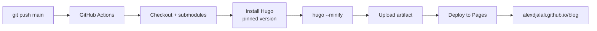

[Back to Spec](../epics/epic-01-project-foundation.md)

# Story 1.3 — Set Up GitHub Actions and Deploy

**Epic**: 1 — Project Foundation & Deployment Pipeline **Points**: 3 **Status**: Todo

---

## Story

**As a** blog developer, **I want** a GitHub repository with an automated CI/CD pipeline that builds and deploys the Hugo site to GitHub Pages on every push to main, **So that** the deployment pipeline is validated early before content work begins.

**Acceptance Criteria**:

- GitHub repository created at `alexdjalali/blog` (public)
- `.github/workflows/hugo.yml` uses Hugo's official recommended workflow:
  - `actions/checkout@v4` with `submodules: recursive`
  - Hugo extended edition installed with pinned version matching local install
  - `hugo --minify` build step
  - `actions/upload-pages-artifact@v3` + `actions/deploy-pages@v4`
- Workflow triggers on push to `main` branch
- Workflow has correct permissions: `contents: read`, `pages: write`, `id-token: write`
- Concurrency group `"pages"` prevents parallel deploys
- GitHub Pages source configured to "GitHub Actions" (via `gh api`)
- All source code pushed to `main`
- GitHub Actions workflow completes successfully
- Site accessible at `https://alexdjalali.github.io/blog/`

**Testing**: Deployment verification:

- `gh repo view alexdjalali/blog` — repo exists
- `gh run list --repo alexdjalali/blog --limit 1` — successful run
- `curl -s -o /dev/null -w "%{http_code}" https://alexdjalali.github.io/blog/` — returns 200

---

## Architecture References

- [Implementation Plan](../plans/2026-02-21-personal-blog.md) — Task 2
- [Hugo GitHub Pages Docs](https://gohugo.io/hosting-and-deployment/hosting-on-github/)

---

## Architecture Diagram

---

## Checklist

### Coding Patterns (apply where appropriate)

- [ ] **DRY** — no duplicated logic; extract shared utilities

### Testing Requirements

- [ ] GitHub Actions workflow runs successfully
- [ ] Live site returns HTTP 200
- [ ] Submodules checkout correctly in CI

### Documentation Requirements

- [ ] Workflow file documented with pinned Hugo version
- [ ] GitHub Pages source configuration documented

### Completion Workflow

- [ ] All checklist items above are satisfied
- [ ] Run project quality gates (format, lint, type check, tests)
- [ ] All quality gates pass
- [ ] Commit with conventional commit message
- [ ] Update story status from "Todo" to "Complete" (handled by /spec-verify)
