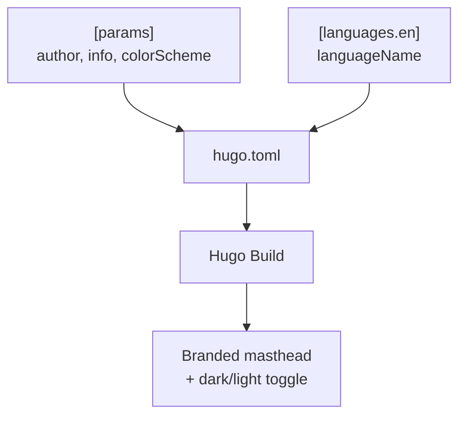

[Back to Spec](../epics/epic-02-site-configuration.md)

# Story 2.1 — Configure Site Identity and Display

**Epic**: 2 — Site Configuration **Points**: 2 **Status**: Todo

---

## Story

**As a** blog visitor, **I want** the site to display Alex Djalali's identity with a professional tagline, dark/light mode toggle, and Creative Commons license, **So that** the blog feels personalized and properly branded.

**Acceptance Criteria**:

- `hugo.toml` `[params]` section configured:
  - `author = "Alex Djalali"`
  - `description = "Alex Djalali's personal blog"`
  - `keywords = "nlp,ai,linguistics,computational-semantics,blog"`
  - `info = ["NLP · AI · Computational Semantics"]`
  - `dateFormat = "January 2, 2006"`
  - `since = 2026`
  - `colorScheme = "auto"`
  - `hideColorSchemeToggle = false`
  - `enableEmoji = true`
- CC BY-SA-4.0 license HTML configured in `license` param
- `avatarURL` NOT set (omitted until real photo provided)
- `[languages.en]` configured with `languageName = "English"`
- Dark/light mode toggle visible and functional in browser
- Site title displays "Alex Djalali" in masthead

**Testing**: Visual verification:

- `hugo server` — site shows correct title, tagline, dark/light toggle
- Toggle switches between color schemes
- Footer shows CC BY-SA-4.0 license link
- No avatar rendered (intentionally)

---

## Architecture References

- [Implementation Plan](../plans/2026-02-21-personal-blog.md) — Task 3
- [Hugo Coder Configuration](https://github.com/luizdepra/hugo-coder/blob/main/docs/configurations.md)

---

## Architecture Diagram

---

## Checklist

### Coding Patterns (apply where appropriate)

- [ ] **DRY** — no duplicated logic; extract shared utilities

### Testing Requirements

- [ ] Dark/light mode toggle works
- [ ] Site title and tagline render correctly
- [ ] License link in footer is correct

### Documentation Requirements

- [ ] Configuration values documented in `hugo.toml` comments where non-obvious

### Completion Workflow

- [ ] All checklist items above are satisfied
- [ ] Run project quality gates (format, lint, type check, tests)
- [ ] All quality gates pass
- [ ] Commit with conventional commit message
- [ ] Update story status from "Todo" to "Complete" (handled by /spec-verify)
