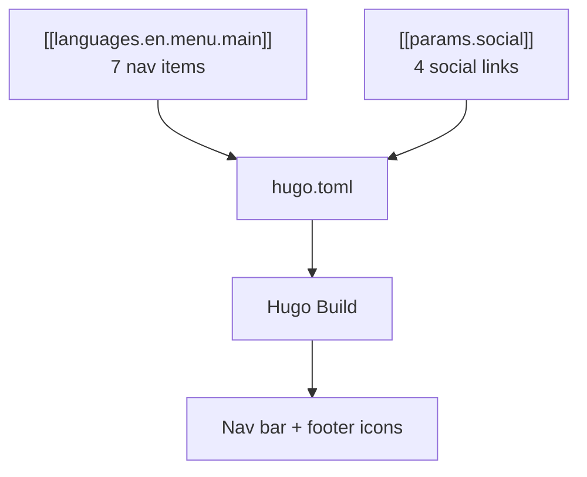

[Back to Spec](../epics/epic-02-site-configuration.md)

# Story 2.2 — Configure Navigation and Social Links

**Epic**: 2 — Site Configuration **Points**: 3 **Status**: Complete

---

## Story

**As a** blog visitor, **I want** a navigation bar with links to all major sections and social icons in the footer, **So that** I can easily navigate the site and find Alex on other platforms.

**Acceptance Criteria**:

- Navigation menu configured using `[[languages.en.menu.main]]` format (NOT `[[menu.main]]`)
- 7 menu items in this order:
  1. Home (weight 1, url "/")
  2. Publications (weight 2, url "publications/")
  3. Posts (weight 3, url "posts/")
  4. Categories (weight 4, url "categories/")
  5. Tags (weight 5, url "tags/")
  6. About (weight 6, url "about/")
  7. CV (weight 7, url "cv/")
- No Search nav item (Hugo Coder doesn't support search)
- Social links configured using `[[params.social]]`:
  - GitHub: `fa-brands fa-github fa-2x`, url `https://github.com/alexdjalali/`
  - LinkedIn: `fa-brands fa-linkedin fa-2x`, url placeholder `https://www.linkedin.com/in/alex-djalali-272502273/`
  - Google Scholar: `fa-brands fa-google-scholar fa-2x`, url placeholder (Alex to provide)
  - RSS: `fa-solid fa-rss fa-2x`, url `https://alexdjalali.github.io/blog/index.xml`, rel="alternate", type="application/rss+xml"
- All navigation items render in the nav bar
- All social icons render in the footer with correct Font Awesome icons
- Social icon links open in new tab where appropriate

**Testing**: Visual verification:

- `hugo server` — all 7 nav items visible and clickable
- Footer shows 4 social icons (GitHub, LinkedIn, Scholar, RSS)
- All social icons render correctly (no broken/missing icons)
- Nav items may 404 until content is created — that's expected

---

## Architecture References

- [Implementation Plan](../plans/2026-02-21-personal-blog.md) — Task 3
- [Hugo Coder Example Config](https://github.com/luizdepra/hugo-coder/blob/main/exampleSite/hugo.toml)

---

## Architecture Diagram

---

## Checklist

### Coding Patterns (apply where appropriate)

- [ ] **DRY** — no duplicated logic; extract shared utilities

### Testing Requirements

- [ ] All 7 nav items render
- [ ] All 4 social icons render with correct FA classes
- [ ] Menu uses language-specific format

### Documentation Requirements

- [ ] Social link placeholders marked for Alex to update

### Completion Workflow

- [ ] All checklist items above are satisfied
- [ ] Run project quality gates (format, lint, type check, tests)
- [ ] All quality gates pass
- [ ] Commit with conventional commit message
- [ ] Update story status from "Todo" to "Complete" (handled by /spec-verify)
