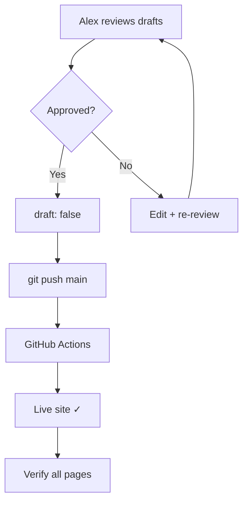

[Back to Spec](../epics/epic-04-launch.md)

# Story 4.1 — Content Review Gate and Publish

**Epic**: 4 — Launch & Verification **Points**: 3 **Status**: Todo

---

## Story

**As a** blog owner, **I want** to review all draft content for accuracy before publishing, then deploy the complete site, **So that** the live blog contains only approved, accurate content.

**Acceptance Criteria**:

- All content files presented to Alex for review via `hugo server --buildDrafts`:
  - `content/about.md`
  - `content/publications.md`
  - `content/cv.md`
  - `content/posts/hello-world.md`
  - `content/posts/on-natural-logic.md`
- Alex explicitly approves content (or requests changes, which are incorporated)
- After approval, all files updated: `draft: true` → `draft: false`
- `hugo` build (without `--buildDrafts`) produces all expected pages
- Changes committed and pushed to `main`
- GitHub Actions workflow completes successfully
- Live site verification:
  - `https://alexdjalali.github.io/blog/` — homepage renders
  - `/about/` — bio page accessible
  - `/publications/` — publications page accessible
  - `/cv/` — CV page accessible
  - `/posts/` — post list with both entries
  - `/tags/` — populated taxonomy page
  - `/categories/` — populated taxonomy page
  - All nav links resolve to valid pages
  - Social icons render correctly
- **Rollback plan documented**: `git revert HEAD && git push` or disable Pages via `gh api`

**Testing**: Production deployment verification:

- `hugo` — build succeeds with all pages in `public/`
- `gh run list --repo alexdjalali/blog --limit 1` — successful run
- `curl -s -o /dev/null -w "%{http_code}" https://alexdjalali.github.io/blog/` — 200
- `curl -s -o /dev/null -w "%{http_code}" https://alexdjalali.github.io/blog/about/` — 200
- `curl -s -o /dev/null -w "%{http_code}" https://alexdjalali.github.io/blog/posts/` — 200

---

## Architecture References

- [Implementation Plan](../plans/2026-02-21-personal-blog.md) — Task 9

---

## Architecture Diagram

---

## Checklist

### Coding Patterns (apply where appropriate)

- [ ] **DRY** — no duplicated logic; extract shared utilities

### Testing Requirements

- [ ] All pages render in production build (no `--buildDrafts`)
- [ ] GitHub Actions deploys successfully
- [ ] Live site returns 200 for all key URLs
- [ ] All nav links resolve
- [ ] Social icons render

### Documentation Requirements

- [ ] Rollback procedure documented
- [ ] Content approval noted in commit message

### Completion Workflow

- [ ] All checklist items above are satisfied
- [ ] Run project quality gates (format, lint, type check, tests)
- [ ] All quality gates pass
- [ ] Commit with conventional commit message
- [ ] Update story status from "Todo" to "Complete" (handled by /spec-verify)
