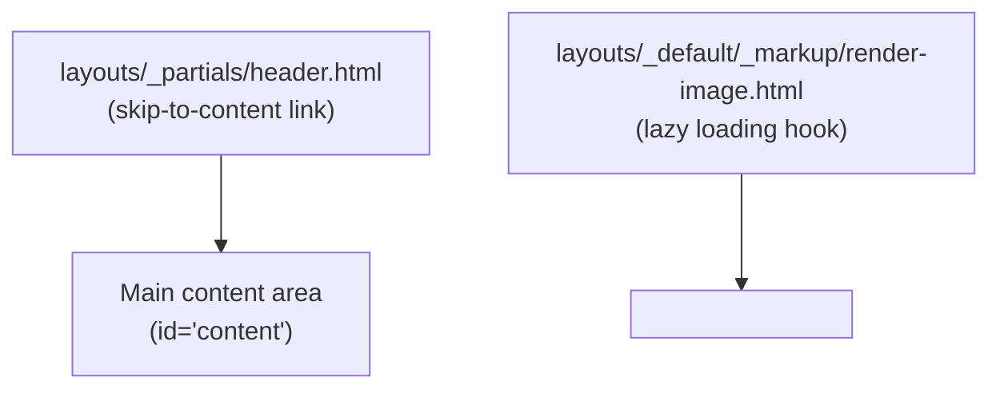

[Back to Spec](../epics/epic-06-standard-blog-features.md)

# Story 6.1 — Accessibility and Performance Enhancements

**Epic**: 6 — Standard Blog Features **Points**: 3 **Status**: Complete

---

## Story

**As a** blog visitor, **I want** the site to be accessible via keyboard navigation and load images efficiently, **So that** I can navigate the site regardless of input method and pages load quickly.

**Acceptance Criteria**:

- A visually hidden "Skip to content" link is present in the page header, visible on focus
- All content images use `loading="lazy"` attribute via a custom Hugo render hook
- The skip-to-content link targets the main content area with correct `id` attribute
- `hugo --minify` build succeeds with all new templates
- No regressions in existing page rendering

**Testing**: Build verification and manual browser testing:

- `hugo --minify` — build succeeds
- Skip-to-content link visible on Tab keypress
- Images in post content have `loading="lazy"` in rendered HTML

---

## Architecture References

- [ADR-0002](../../adr/0002-standard-blog-features.md)

---

## Architecture Diagram

---

## Checklist

### Coding Patterns (apply where appropriate)

- [x] **DRY** — Render hook applies lazy loading to all images uniformly

### Testing Requirements

- [x] Build succeeds with new layout overrides
- [x] Skip-to-content link functions in browser
- [x] Images render with lazy loading attribute

### Completion Workflow

- [x] All checklist items above are satisfied
- [x] `hugo --minify` build passes
- [x] Commit with conventional commit message
- [x] Update story status from "Todo" to "Complete"
