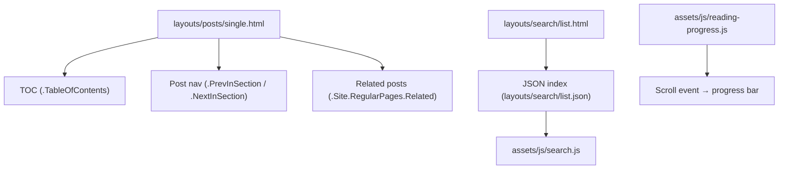

[Back to Spec](../epics/epic-06-standard-blog-features.md)

# Story 6.2 — Content Discoverability Features

**Epic**: 6 — Standard Blog Features **Points**: 3 **Status**: Complete

---

## Story

**As a** blog reader, **I want** table of contents, post navigation, related posts, and search functionality, **So that** I can discover and navigate between content easily.

**Acceptance Criteria**:

- Long posts display a table of contents (configurable levels 2-3 via `hugo.toml`)
- Each post shows previous/next navigation links at the bottom
- Each post shows up to 3 related posts based on tag/category similarity
- A `/search/` page provides client-side search against post titles, content, and tags
- Search is powered by a Hugo-generated JSON index with no external dependencies
- Reading progress bar appears at the top of post pages, tracking scroll position
- All features degrade gracefully when JavaScript is disabled

**Testing**: Build verification and manual browser testing:

- `hugo --minify` — build succeeds
- TOC renders on posts with multiple headings
- Previous/next links navigate correctly
- Search returns results for known post titles
- Reading progress bar tracks scroll position

---

## Architecture References

- [ADR-0002](../../adr/0002-standard-blog-features.md)

---

## Architecture Diagram

---

## Checklist

### Coding Patterns (apply where appropriate)

- [x] **DRY** — Single post template consolidates TOC, nav, and related posts
- [x] **Observer Pattern** — Reading progress uses scroll event listener

### Testing Requirements

- [x] Build succeeds with search JSON output
- [x] TOC, post nav, and related posts render correctly
- [x] Search returns relevant results
- [x] Reading progress bar tracks scroll position

### Completion Workflow

- [x] All checklist items above are satisfied
- [x] `hugo --minify` build passes
- [x] Commit with conventional commit message
- [x] Update story status from "Todo" to "Complete"
