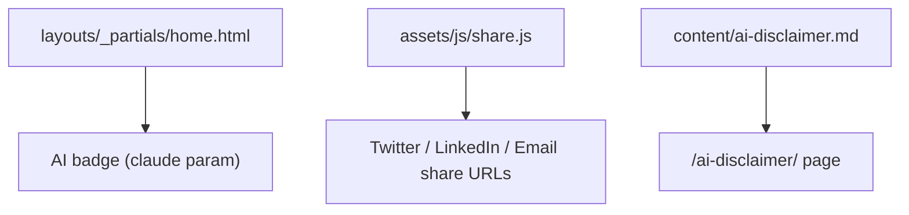

[Back to Spec](../epics/epic-06-standard-blog-features.md)

# Story 6.3 — Reader Engagement and AI Transparency

**Epic**: 6 — Standard Blog Features **Points**: 2 **Status**: Complete

---

## Story

**As a** blog owner, **I want** social share buttons on posts and transparent AI attribution badges, **So that** readers can share content and understand which posts used AI assistance.

**Acceptance Criteria**:

- Each post has share buttons for Twitter, LinkedIn, and email
- Share buttons use the post's title and URL in the share payload
- Each post on the homepage displays an AI badge next to the date
- AI badge uses `claude: true/false` front matter parameter
- An AI Disclaimer page (`/ai-disclaimer/`) explains the badge system
- Share buttons function without external JS dependencies

**Testing**: Build verification and manual browser testing:

- `hugo --minify` — build succeeds
- Share buttons generate correct share URLs
- AI badges render on homepage post cards
- AI Disclaimer page accessible at `/ai-disclaimer/`

---

## Architecture References

- [ADR-0002](../../adr/0002-standard-blog-features.md)

---

## Architecture Diagram

---

## Checklist

### Coding Patterns (apply where appropriate)

- [x] **DRY** — Share button logic centralized in single JS file

### Testing Requirements

- [x] Share buttons generate valid share URLs
- [x] AI badges render correctly based on front matter
- [x] AI Disclaimer page renders

### Completion Workflow

- [x] All checklist items above are satisfied
- [x] `hugo --minify` build passes
- [x] Commit with conventional commit message
- [x] Update story status from "Todo" to "Complete"
