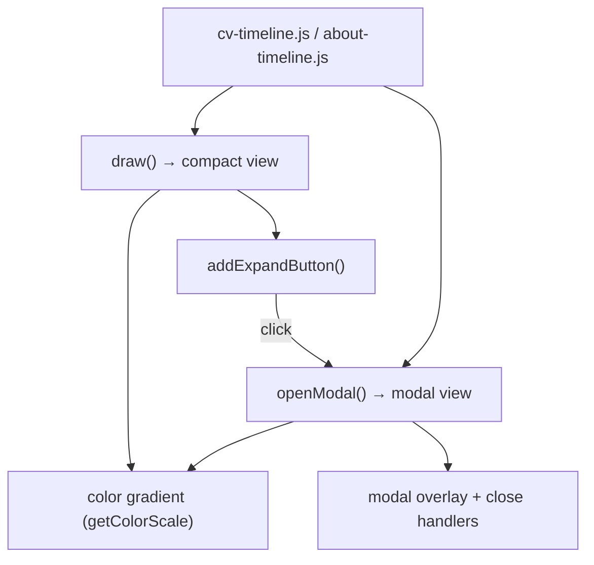

[Back to Spec](../epics/epic-07-timeline-and-ui-refinements.md)

# Story 7.1 — Timeline Modal Expansion and Color Gradient

**Epic**: 7 — Timeline Components and UI Refinements **Points**: 3 **Status**: Complete

---

## Story

**As a** site visitor viewing the CV or About page, **I want** to expand the timeline into a full modal view and see individually colored bars, **So that** I can identify each career/life entry without relying on truncated labels.

**Acceptance Criteria**:

- An "Expand Timeline" button appears below the compact timeline on both CV and About pages
- Clicking the button opens a full-viewport modal with larger swim lanes (36px height)
- Bar labels are shown inside modal bars when they fit
- Each bar has a unique color from a sequential HSL gradient (red tones)
- Dark mode uses lighter gradient tones for readability
- Modal closes via: close button (x), backdrop click, Escape key
- CV timeline modal: clicking a bar scrolls to the corresponding CV entry below
- Tooltips show on hover in both compact and modal views
- Removed: inline bar labels from compact view, job/education legend

**Testing**: Build and manual verification:

- `hugo --minify` — build succeeds
- Expand button appears on both CV and About pages
- Modal opens and closes via all three methods
- Bar colors form a visible gradient
- Dark mode gradient adapts to dark background

---

## Architecture References

- [ADR-0003](../../adr/0003-timeline-components-and-ui-refinements.md)

---

## Architecture Diagram

---

## Checklist

### Coding Patterns (apply where appropriate)

- [x] **DRY** — `getColorScale()`, `assignLanes()`, tooltip handlers shared between compact and modal
- [x] **Observer Pattern** — Event listeners for Escape, backdrop click, scroll-triggered fade-in
- [x] **Facade Pattern** — `openModal()` encapsulates modal lifecycle

### Testing Requirements

- [x] Modal opens and closes correctly on both pages
- [x] Color gradient renders in light and dark modes
- [x] CV modal click-to-scroll navigates to correct entry

### Completion Workflow

- [x] All checklist items above are satisfied
- [x] `hugo --minify` build passes
- [x] Commit with conventional commit message
- [x] Update story status from "Todo" to "Complete"
