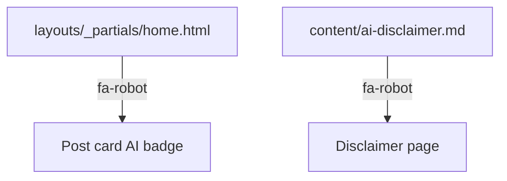

[Back to Spec](../epics/epic-07-timeline-and-ui-refinements.md)

# Story 7.2 — AI Badge Icon Update

**Epic**: 7 — Timeline Components and UI Refinements **Points**: 2 **Status**: Complete

---

## Story

**As a** blog reader, **I want** the AI assistance badge to use a neutral icon rather than thumbs-up/down, **So that** the badge communicates factual disclosure without implying value judgment.

**Acceptance Criteria**:

- AI-assisted posts use `fa-robot` icon with blue color (`#2980b9`)
- Non-AI-assisted posts use `fa-robot` icon with gray color (`#bbb`)
- Both `layouts/_partials/home.html` and `content/ai-disclaimer.md` updated consistently
- No other changes to badge behavior or positioning

**Testing**: Build and visual verification:

- `hugo --minify` — build succeeds
- Homepage post cards show robot icon (not thumbs)
- AI Disclaimer page references robot icon

---

## Architecture References

- [ADR-0003](../../adr/0003-timeline-components-and-ui-refinements.md)

---

## Architecture Diagram

---

## Checklist

### Coding Patterns (apply where appropriate)

- [x] **DRY** — Same icon class used in both template and content page

### Testing Requirements

- [x] Robot icon renders on homepage post cards
- [x] AI Disclaimer page matches homepage icon usage

### Completion Workflow

- [x] All checklist items above are satisfied
- [x] `hugo --minify` build passes
- [x] Commit with conventional commit message
- [x] Update story status from "Todo" to "Complete"
